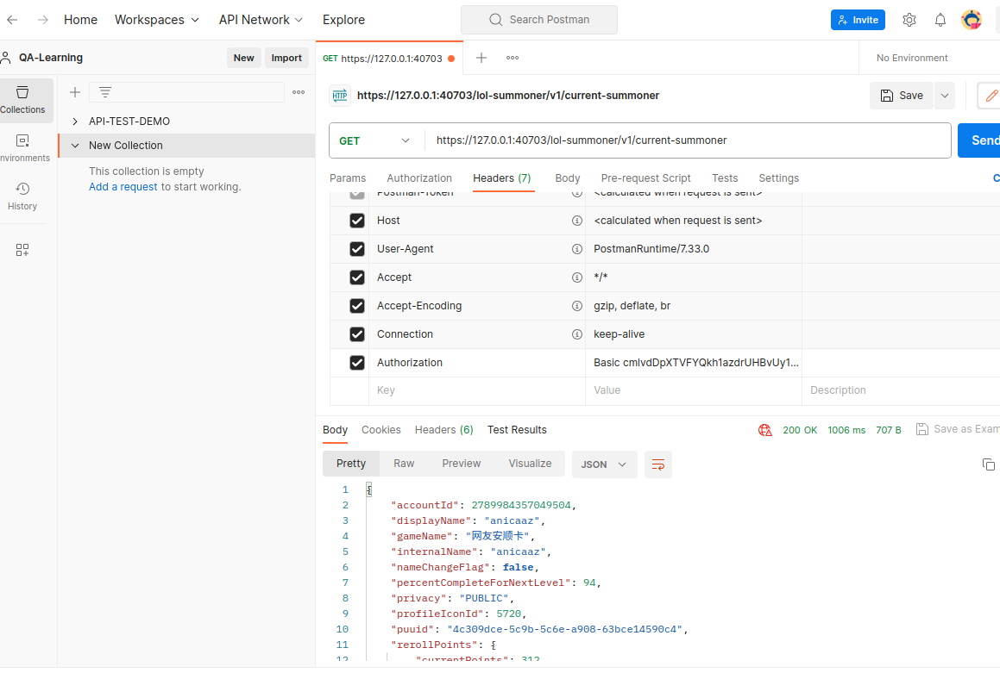

# LeagueWare--仿照Wegame从零构建第三方英雄联盟客户端助手

**项目依赖**

```xml
<!--JSON转Map依赖-->
<dependency>
    <groupId>com.fasterxml.jackson.core</groupId>
    <artifactId>jackson-databind</artifactId>
    <version>2.13.0</version>
</dependency>
```

```xml
<!--Lombok依赖-->
<!-- https://mvnrepository.com/artifact/org.projectlombok/lombok -->
<dependency>
    <groupId>org.projectlombok</groupId>
    <artifactId>lombok</artifactId>
    <version>1.18.30</version>
    <scope>provided</scope>
</dependency>

```


**注意, 不同于Web项目, JavaFX项目在引入maven依赖后, 还需要将依赖放入module-info中**

比如这样子

```java
module com.anicaaz.leaguewarefx {
    requires javafx.controls;
    requires javafx.fxml;
    requires lombok;
    requires com.fasterxml.jackson.databind;

    opens com.anicaaz.leaguewarefx to javafx.fxml;
    exports com.anicaaz.leaguewarefx;
    exports com.anicaaz.leaguewarefx.controller;
    opens com.anicaaz.leaguewarefx.controller to javafx.fxml;
}
```


**一些有用的资源**

1. 所有版本的资源文件: https://raw.communitydragon.org/   


## 1. 获取remote-Auth-token 和 app-port

> 当英雄联盟客户端正在运行时, 它会向我们的localhost暴露一个端口. 我们可以通过remote


Windows下(需要提权)

```powershell
wmic PROCESS WHERE name='LeagueClientUx.exe' GET commandline 
```

Linux下

```bash
ps -eo pid,cmd | grep 'LeagueClientUx.exe'
```

- `ps -eo pid,cmd`: 列出所有进程的进程ID（pid）和命令行（cmd）信息。
  - ps: process state的简称
  - eo: 表示你可以制定你要的列
  - cmd则是命令
- `grep 'LeagueClientUx.exe'`: 使用 `grep` 过滤出包含 'LeagueClientUx.exe' 的行，即与你指定的进程相关的信息。


然后就会得到下面这样子一长串的键值对

```
-riotclient-auth-token=E4z7AQD982BWJO09cYzLrA --riotclient-app-port=40465 --no-rads --disable-self-update --region=NA --locale=en_US --client-config-url=https://clientconfig.rpg.riotgames.com --riotgamesapi-standalone --riotgamesapi-settings=eyJjbGllbnQtY29uZmlnIjp7InVybCI6Imh0dHBzOi8vY2xpZW50Y29uZmlnLnJwZy5yaW90Z2FtZXMuY29tIn0sImRlZmF1bHRfcmVnaW9uIjoiTkEiLCJnbG9iYWxzIjp7InNlc3Npb24taWQiOiIxZWY1NDUxMS03OGQ2LTU3NGUtOTY1MC1lMTFiOTUyMzgwOTQifSwicGF0Y2hsaW5lX2lkIjoibGl2ZSIsInByb2R1Y3QtaW50ZWdyYXRpb24iOnsiYXBwLXVwZGF0ZS1zdGF0dXMiOiJDOi9Qcm9ncmFtRGF0YS9SaW90IEdhbWVzL01ldGFkYXRhL2xlYWd1ZV9vZl9sZWdlbmRzLmxpdmUvbGVhZ3VlX29mX2xlZ2VuZHMubGl2ZS51cGRhdGUtc3RhdHVzLmpzb24iLCJoZWFydGJlYXQiOiJDOi91c2Vycy9hbmljYWEvQXBwRGF0YS9Mb2NhbC9SaW90IEdhbWVzL1Jpb3QgQ2xpZW50L0RhdGEvU2Vzc2lvbnMvMWVmNTQ1MTEtNzhkNi01NzRlLTk2NTAtZTExYjk1MjM4MDk0L0U0ejdBUUQ5ODJCV0pPMDljWXpMckEuaGVhcnRiZWF0Lmpzb24iLCJsb2NrZmlsZSI6IkM6L1Byb2dyYW1EYXRhL1Jpb3QgR2FtZXMvTWV0YWRhdGEvbGVhZ3VlX29mX2xlZ2VuZHMubGl2ZS9sZWFndWVfb2ZfbGVnZW5kcy5saXZlLmxvY2tmaWxlIiwic2V0dGluZ3MiOiJDOi9Qcm9ncmFtRGF0YS9SaW90IEdhbWVzL01ldGFkYXRhL2xlYWd1ZV9vZl9sZWdlbmRzLmxpdmUvbGVhZ3VlX29mX2xlZ2VuZHMubGl2ZS5wcm9kdWN0X3NldHRpbmdzLnlhbWwifSwicHJvZHVjdF9pZCI6ImxlYWd1ZV9vZl9sZWdlbmRzIiwicHVibGlzaGVyIjoicmlvdCIsInJlZ2lvbl9kYXRhIjp7Ik5BIjp7ImF2YWlsYWJsZV9sb2NhbGVzIjpbImNzX0NaIiwiZGVfREUiLCJlbF9HUiIsImVuX0FVIiwiZW5fR0IiLCJlbl9QSCIsImVuX1NHIiwiZW5fVVMiLCJlc19BUiIsImVzX0VTIiwiZXNfTVgiLCJmcl9GUiIsImh1X0hVIiwiaXRfSVQiLCJqYV9KUCIsImtvX0tSIiwicGxfUEwiLCJwdF9CUiIsInJvX1JPIiwicnVfUlUiLCJ0aF9USCIsInRyX1RSIiwidmlfVk4iLCJ6aF9NWSIsInpoX1RXIl0sImRlZmF1bHRfbG9jYWxlIjoiZW5fVVMiLCJyc28iOnsiY2xpZW50IjoibG9sIn19fSwicmlvdGNsaWVudCI6eyJhcHAtcG9ydCI6IjQwNDY1IiwiYXV0aC10b2tlbiI6IkU0ejdBUUQ5ODJCV0pPMDljWXpMckEifSwicmlvdGdhbWVzYXBpIjp7InBlcnNpc3RlbmNlLXBhdGgiOiJDOi91c2Vycy9hbmljYWEvQXBwRGF0YS9Mb2NhbC9SaW90IEdhbWVzL0xlYWd1ZSBvZiBMZWdlbmRzIn0sInJzb19hdXRoIjp7ImF1dGhvcml6YXRpb24ta2V5IjoiZXcwS0lDQWdJQ0pqYjJSbElqb2dJbVJZWTNoUGJGSnBUMVZXTUZWdFpISlZhMHAzV2xSYWVGVkZhRTFVUjA1U1RVWkZkVmxYYkVWaFdFWklVVmQzTUU5WFJrSmFNbWh6WTBSR1NtTnFiRU5hZHowOUlpd05DaUFnSUNBaVkyOWtaVjkyWlhKcFptbGxjaUk2SUNJNFNVWkxWVk4xVGs5WWFqaHpTM0p0V0RJNGVHSm5aMUkwUmxrNWVtaG9ObVk0VkZReFFuZDJaa3BVZVZCMGJqZGpWbUpvVEZKT2VrdEVVa2RvUkhWVk5sQjVhRnBmV0RKWGRsVlhVMmQzTjFjMFkxVldaeUlOQ24wPSJ9fQ== --rga-lite --remoting-auth-token=WMQXBHuk7kPpoS-QyqXm5A --respawn-command=LeagueClient.exe --respawn-display-name=League of Legends --app-port=40703 --install-directory=C:\Riot Games\League of Legends --app-name=LeagueClient --ux-name=LeagueClientUx --ux-helper-name=LeagueClientUxHelper --log-dir=LeagueClient Logs --crash-reporting= --crash-environment=NA1 --app-log-file-path=C:/Riot Games/League of Legends/Logs/LeagueClient Logs/2023-11-10T20-45-00_1740_LeagueClient.log --app-pid=1740 --output-base-dir=C:\Riot Games\League of Legends --no-proxy-server --ignore-certificate-errors

```


拿到了以上输出之后, 我们就可以开始对其进行字符串处理了.

在使用java的情况下, 我们可以用`ProcessBuilder`类的start方法来创建一个进程, 执行获取正在运行的英雄联盟客户端的参数.

```java
package com.anicaaz.leaguewarefx.utils;

import java.io.BufferedReader;
import java.io.IOException;
import java.io.InputStreamReader;
import java.util.List;

public class ExecuteCommand {

    /**
     * Get the token of current running lcu process.
     * @return The Remoting-Auth-Token of cmdline output.
     */
    public static String getRemoteAuthToken() {
        ProcessBuilder processBuilder = new ProcessBuilder("bash", "-c", "ps -eo cmd | grep 'LeagueClientUx.exe'");
        String remoteAuthToken = null;
        try {
            Process lcuProcess = processBuilder.start();
            BufferedReader reader = new BufferedReader(new InputStreamReader(lcuProcess.getInputStream()));
            String line;
            while ((line = reader.readLine()) != null) {
                if (line.contains("--remoting-auth-token")) {
                    remoteAuthToken = line.split("--remoting-auth-token=")[1].split(" ")[0];
                    break;
                }
            }
        } catch (IOException e) {
            throw new RuntimeException(e);
        }
        return remoteAuthToken;
    }

    /**
     * Get the port that current lcu in running on
     * @return The port that current lcu in running on
     */
    public static String getAppPort() {
        ProcessBuilder processBuilder = new ProcessBuilder("bash", "-c", "ps -eo cmd | grep 'LeagueClientUx.exe'");
        String appPort = null;
        try {
            Process process = processBuilder.start();
            String line;
            BufferedReader reader = new BufferedReader(new InputStreamReader(process.getInputStream()));
            while ((line = reader.readLine())!= null) {
                if (line.contains("--app-port")) {
                    appPort = line.split("--app-port=")[1].split(" ")[0];
                    break;
                }
            }
        } catch (Exception e) {
            throw new RuntimeException(e);
        }
        return appPort;
    }
}

```


注意这里拿到了token后, 还需要

1. 先使用base64加密
2. 再在前面加上 `Basic ` 注意Basic后面需要有一个空格


这样,我们就获取好了向LCU API发送请求的请求参数了.


## 2. LCU Api文档

> https://lcu.vivide.re/


## 3. 向LCU API发送第一个请求.

请求参数: Authorization: 处理好的token

url: https://localhost:{portnumber}/apixxx

注意 请求必须是https协议

```
https://127.0.0.1:40703/lol-summoner/v1/current-summoner
```




访问接口测试通过后, 就可以用httpclient来模拟请求了.


Http请求工具类

```
package com.anicaaz.leaguewarefx.utils;

import com.fasterxml.jackson.databind.ObjectMapper;
import lombok.AllArgsConstructor;
import lombok.Data;
import lombok.NoArgsConstructor;

import javax.net.ssl.HttpsURLConnection;
import javax.net.ssl.SSLContext;
import javax.net.ssl.TrustManager;
import javax.net.ssl.X509TrustManager;
import java.io.IOException;
import java.net.HttpURLConnection;
import java.net.URL;
import java.util.Map;

@Data
@AllArgsConstructor
@NoArgsConstructor
public class HttpsUtils {

    private String apiUrl;
    private String requestMethod;

    public Map<String, Object> sendHttpRequest(String authorizationToken) throws IOException {
        // 设置请求地址
        URL url = new URL(apiUrl);
        disableSslVerification();
        // 打开连接
        HttpURLConnection connection = (HttpURLConnection) url.openConnection();

        // 设置请求方法
        connection.setRequestMethod(requestMethod);

        // 添加请求头，设置Authorization参数
        connection.setRequestProperty("Authorization", authorizationToken);

        // 获取响应码
        int responseCode = connection.getResponseCode();
        System.out.println("Response Code: " + responseCode);

        // 读取响应内容并将其映射到Map
        ObjectMapper objectMapper = new ObjectMapper();
        Map<String, Object> responseMap = objectMapper.readValue(connection.getInputStream(), Map.class);

        // 关闭连接
        connection.disconnect();

        // 返回响应的Map
        return responseMap;
    }

    public static String constructUrl(String baseUrl, String appPort, String requestUrl) {
        return baseUrl + appPort + "/" + requestUrl;
    }

    private void disableSslVerification() {
        try {
            TrustManager[] trustAllCerts = new TrustManager[]{new X509TrustManager() {
                public java.security.cert.X509Certificate[] getAcceptedIssuers() {
                    return null;
                }

                public void checkClientTrusted(
                        java.security.cert.X509Certificate[] certs, String authType) {
                }

                public void checkServerTrusted(
                        java.security.cert.X509Certificate[] certs, String authType) {
                }
            }};

            SSLContext sc = SSLContext.getInstance("SSL");
            sc.init(null, trustAllCerts, new java.security.SecureRandom());
            HttpsURLConnection.setDefaultSSLSocketFactory(sc.getSocketFactory());
        } catch (Exception e) {
            e.printStackTrace();
        }
    }
}

```

注意, 这里需要**禁用ssl验证**. 否则会因为没有证书而一直无法发送请求.


## 项目中的八股

1. Volatile是什么？有什么作用？

   ```
   volatile 关键字在 Java 中用于确保变量的改变对所有线程都是可见的。它是 Java 并发编程中用来解决变量同步问题的一个关键字。在多线程环境下，volatile 确保了变量的读写操作都是直接在主内存中进行的，而不是先在各自线程的工作内存中处理，然后再写回主内存。这样一来，一个线程修改了某个 volatile 变量的值，其他线程立即就能看到这个改变。
   
   不使用 volatile 关键字可能导致的问题：
   
   可见性问题：如果一个线程修改了一个非 volatile 变量的值，其他线程可能看不到这个改变。这是因为每个线程可能有自己的本地内存（线程缓存），而非 volatile 变量的值可能仅在一个线程的本地内存中更新，而没有被写回主内存。
   
   指令重排序：在没有 volatile 关键字的情况下，编译器可能会重新排序代码中的指令，以优化性能。这可能会破坏程序的逻辑流程，尤其是在并发环境中。而 volatile 变量会限制这种重排序。
   
   在你的案例中，如果不使用 volatile 关键字，那么当 stopRequested 在一个线程中被修改时，正在运行 monitorButtonClick 方法的另一个线程可能无法立即看到这个改变。这可能会导致线程不会如预期的那样停止。
   
   总的来说，如果你正在处理多线程环境中的共享变量，并且这些变量可能会被多个线程同时读写，那么使用 volatile 关键字是一种简单有效的保证变量状态对所有线程都一致可见的方法。然而，它并不处理更复杂的原子性问题（比如计数器递增等操作），这种情况下需要使用其他的同步机制，如 synchronized 或 java.util.concurrent 包下的类。
   ```

   