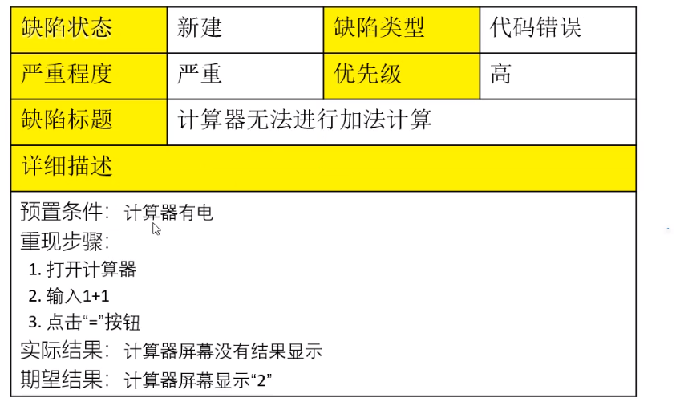
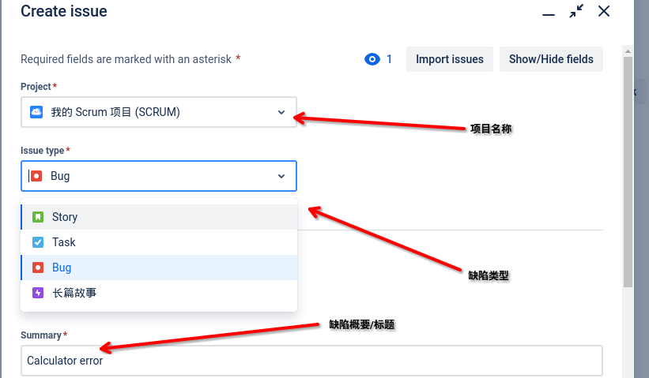
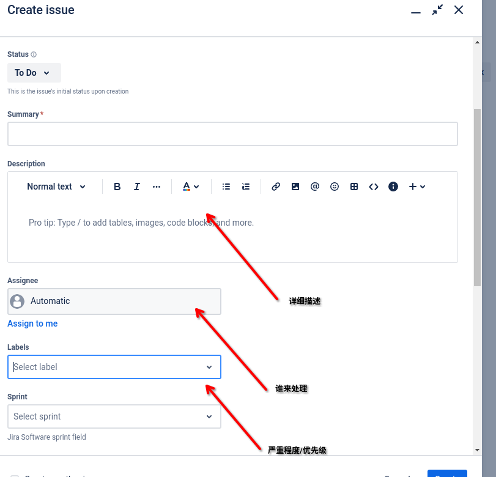

# 1. 软件缺陷

例子:计算器 屏幕不能显示结果

​	

**缺陷的基本内容**

1. 缺陷标题
2. 预置条件
3. 重现步骤
4. 期望结果
5. 实际结果

**缺陷的状态**

1. 新建
2. 打开
3. 修复
4. 关闭

**缺陷的严重程度**

1. 致命 (无法打开)
2. 严重 (主要功能缺失)
3. 一般 (功能异常)
4. 建议 (可改可不改)

**缺陷的优先级**

1.低

2.中

3.高

> 测试人员只能对优先级提出建议, 真正决定其优先级的是项目经理/领导

**软件缺陷的类型**

1. 代码错误
2. 设计缺陷
3. 性能问题
4. 安全相关

**软件缺陷的跟踪流程**

1. 提交 (测试)

2. 确认 (开发)

3. 打开 (缺陷状态)

4. 修复 (开发)

5. 回归 (测试)

6. 关闭 (缺陷状态)

# 2. Jira

> 提高协作效率

## 2.1 Jira的介绍

> 由Atlassian开发的一款软件问题跟踪,管理工具

* 支持多语言
* 支持多平台运行
* 配置灵活, 功能强大

## 2.2 Jira的使用者

1. 企业管理层
2. 项目经理
3. 软件测试人员
4. 开发人员 
5. 运维/设计

## 2.3 Jira中的问题(Issue)

Issue包括

1. 缺陷
2. 新功能
3. 新人物
4. 改进

## 2.4 Jira中的工作流

To do -> In progress -> in review -> done

(待办)-> 进行中->评审中->进行结束

工作流: 问题的不同阶段

也可以自己定义工作流.

## 2.5 Jira的使用

1. 测试提交

2. 开发确认

3. 开发修复

4. 测试回归

## 2.6 创建缺陷

