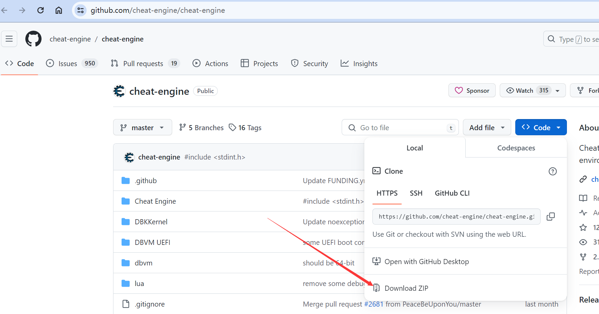
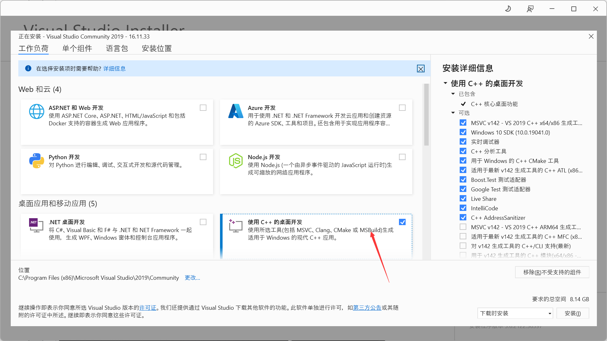
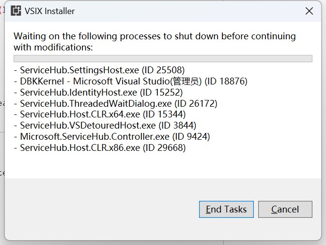
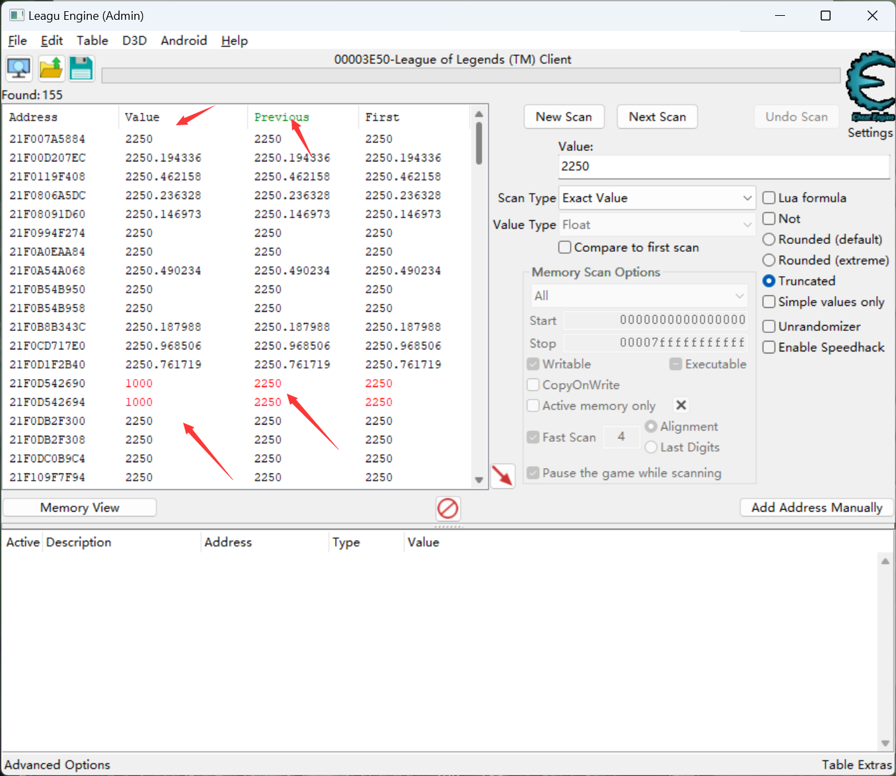

## 0. 前言
在完结了对 英雄联盟**客户端API** 的探索之后，我们就可以开始转向 **英雄联盟游戏端** 的探索了。


:star: 最终目标：制作一款英雄联盟脚本，其包含**走砍、躲避、透视、预判**这四个主要功能

:notebook: 短期目标：制作一个简单的**游戏内绘制**，在左上方显示**游戏数据（补刀，金币）**，以及**无限视距**。


:imp: 笔者有话说：

> 不同于探索 LCU API ， 游戏端的探索 涉及到 **逆向、内存、系统编程**等主题， 远不止 像探索客户端那样简单， 只用**访问接口**。一定要耐下心来，慢慢跟着教程走，切莫好高骛远。**写这个项目，抑或是说探索整个英雄联盟客户端以及游戏端的初衷，并不是为了 功利性地去制作和出售 这些可能导致游戏失去平衡的工具。更多的是兴趣使然**。希望看到这篇教程的读者，也能抱着这个目的，来学习这个项目。
>
> 
>
> 在跟着这篇万字教程做完这个项目后，我觉得你应该可以 **在任何一家公司的技术面试能有谈资**， 并从那些烂大街的**网盘、分布式、音乐、聊天、电商、外卖**项目中脱颖而出，向面试官全方位的展示你的**计算机素养**。
>
> 
>
> 本项目的知识点涵盖：
>
> ​	:white_check_mark: 操作系统 ：**进制转换**  | **内存读写** 丨
>
> ​	:white_check_mark: 计算机网络： **HTTP/HTTPS/WSS** | **JSON** | **API**
>
> ​	:white_check_mark: 开发工具： **IDEA** | **VS 2019(2022)** 丨**Postman** | **DATAGRIP** | **Lazarus**
>
> ​	:white_check_mark: 
>
> ​	:white_check_mark:
>
> ​	:white_check_mark:
>
> ​	:white_check_mark:
>
> 


## 1. 准备步骤
### 1.1 魔改Cheat Engine

> 截止2024年1月11日，该方法是**完全能过外服英雄联盟（AC)，以及国服英雄联盟（ACE)的**。只要跟着步骤走，一定不会弹出黑客软件提示。未来拳头会将外服英雄联盟的反作弊升级成kernel-level的vanguard。该方法可用性存疑。

#### 1.1.2 Lazarus编译器
> Lazarus是一款Pascal的IDE。本质和你们见过的vs-code，vs， idea等等没有任何区别。只不过是编译pascal项目用的。咱们的Cheat Engine（CE）就是用Pascal做的。因为市面上绝大多数网友的反作弊（Anti-Cheat) 都针对CE做了反调试，所以使用官方版的CE，肯定是没法进游戏的（就算进去了，扫内存之后也是卡死）。因此，我们需要从github上下载CE的源码（source code), 然后魔改它，最后重新编译，以绕过检测

Lazarus下载地址: https://sourceforge.net/projects/lazarus/files/Lazarus%20Windows%2032%20bits/Lazarus%202.2.2/


**无法访问的话，可以去百度网盘下载整套资料包**


#### 1.1.2 Cheat Engine下载




#### 1.1.3 修改驱动名称

> 很多AC都将dbk32.sys， dbk64.sys纳入黑名单。因此，你需要修改替换他们的名称。


可以用记事本打开，进去后，找到这三个


将这三个值改成你要的值。


改完之后，ctrl + s保存退出。

#### 1.1.4 修改并编译Cheat Engine

找到该文件，用Lazarus打开。


进去之后应该会看到这样一个界面。


如果这个Object Inspector是空的话，按ctrl + shift + f12 搜索MainForm。就能加载出来。


**忽略Caption上面的三个箭头。只用修改Caption的值**，也就是`Cheat Engine`. 把他改成你想要的。

然后点击Project->Project Options.


**64位里面，OVA也要。所以一共有三个！**

箭头指到的都要替换名字。


#### 1.1.5 完成编译


只用选这三个。然后坐等编译完成。箭头指着的就是编译进度。


完事了之后会跳这个消息。也就标志着编译已经完成！


#### 1.1.6 对成品进行魔改

> 改完了之后，应该可以在bin下面看到这三个文件。随便挑一个打开，可以看到标题还是Cheat Engine。这就比较操蛋了。我们还得接着改。


这时候我们就需要一个叫HxD的软件。下载链接： [HxDSetup.zip](..\..\..\..\..\Downloads\HxDSetup.zip) 

**没法下载的话，同样去网盘资源包里安装**

安装好了后，把你编译好的CE，**拖到** HxD里面去。


然后搜索并替换Cheat Engine字段。注意选择**区分大小写、从头**，然后点击**全部替换**S


改完后保存退出，在重新打开你编译好的CE。应该就能看到这些。当然这里是我的值，你应该和我不一样。


然后，把你修改过一次的exe, 在拖进HxD。搜索并替换**“cheat engine”，“cheatengine”， “CheatEngine”**这三个字段。

然后，再对文本编码：”中的“Unicode（UTF-16 小端）”选项，对四个字段（前面的Cheat Engine加上这三个），再搜索并替换。

以上这7个操作，同样注意选择**区分大小写、从头**，然后点击**全部替换**。

**:warning: 原来字段带空格，你替换的字段也要带空格。你替换的字段长度必须等于原来的字段长度。如果出现替换完没法打开，去Lazarus中选择clean and build重新来。**


#### 1.1.7 VMProtect

可以在资料包里找到。安装后，同样是把修改过的exe拖进去。


点击选项，修改成变异+虚拟


然后点击左栏里的选项。修改成和图片的一样。**输出文件不要动**。


改完后，点击编译。


#### 1.1.8 String Lua Script（可选）


打开Lua Engine，复制黏贴以下代码

```lua
function renameComponents(c)
  local i
  if c.Component then
    for i=0,c.ComponentCount-1 do
      renameComponents(c.Component[i])
    end
  end
 
  if c.Caption then
    c.Caption='WTF'
  end
end
 
 
for i=0,getFormCount()-1 do
    local form = getForm(i)
    for j=0,form.ControlCount-1 do
      renameComponents(form)
    end
 
    form.Caption='Bla'
end
 
registerFormAddNotification(function(f)
  f.registerCreateCallback(function(frm)
    renameComponents(f)
  end)
end)
```


这样所有字符串都会被替换成‘WTF'. 不过似乎用这段脚本的人很多，建议把这个’WTF‘改成你想要的，避免被检测到。如果觉得全部替换后，整个CE都不会用了，关掉CE重启即可。

#### 1.1.9 下载VS2019和WDK。

[https://docs.microsoft.com/de-de/vis.../release-notes](https://docs.microsoft.com/de-de/visualstudio/releases/2019/release-notes)

选择Community 2019 Edition就可以了。

下载完成后点击。




选中这六个。

\- MSVC v142 - VS 2019 C++ x64/x86 Spectre-mitigated libs (latest)
\- MSVC v142 - VS 2019 C++ x64/x86 build tools (latest)
\- C++ ATL for latest v142 build tools (x86 & x64)
\- C++ ATL for latest v142 build tools with Spectre Mitigations (x86 & x64)
\- C++ MFC for latest v142 build tools with Spectre Mitigations (x86 & x64)

然后点击安装就可以。安装完后，下载

https://developer.microsoft.com/de-de/windows/downloads/sdk-archive/


下完后打开，一路点点点就好。

之后下载这两个。

wdk: https://learn.microsoft.com/de-de/windows-hardware/drivers/other-wdk-downloads


sdk: https://developer.microsoft.com/en-us/windows/downloads/windows-sdk/


资料包里也有。下载慢，打不开的话直接在资料包里下。


 :warning:  安装完wdk必须看到这三个。否则后面没法搞。如果没出现这个。一定是你sdk/wdk出问题了。控制面板里删掉重新装。





下完之后打开这个。


双击打开。


ctrl+h替换dbk64. 替换的值，就是你在这个文件里替换的值。

然后点击全部替换。替换完成之后，查找ManufacturerName。替换成你的名字。

接着替换下面信息。


创建完成后，点击应用。


然后点击生成->生成解决方案。

如果出现WDK报错，重新进到DBKKernel。修改Windows SDK版本


编译成功后，回到bin目录下的dbkkernal，应该能看到驱动名称已经被改成你自定义的名称了。


#### 1.1.10  禁用Driver Signature Enforcement（DSE)

放在资料包里了。直接点击exe。输入yes就就可以。一般都是开机先打开exe，再打开，再开游戏。

**update: 使用dse-patcher**。注意，在有kernel-level反作弊的游戏启动前，得先enable-dse。否则游戏不会启动。在启动后，再disable dse。


#### 1.1.11 Module Lua Script

同样放在CE的Lua Engine里执行一下。主要是解决国服英雄联盟把所有的module名字全部隐藏的情况（如下）。当然其他游戏出现这种情况也是用这段代码。

```
symbols = createSymbolList();
symbols.register();
 
function onOpenProcess(pid)
    symbols.unregister();
    symbols = createSymbolList();
    symbols.register();
 
    reinitializeSymbolhandler();
 
    if (pid == 4) then
        return;
    end
 
    local proc = dbk_getPEProcess(pid);
    --printf("proc: %08X", proc);
 
    local peb = readQword(proc + 0x550);
    --printf("peb: %08X", peb);
 
    local ldr = readQword(peb + 0x18);
    --printf("ldr: %08X", ldr);
 
    local index = readQword(ldr + 0x10);
    --printf("index: %08X\n", index);
 
    while (index ~= ldr + 0x10) do
          local mod = readQword(index);
          --printf("mod: %08X", mod);
 
          local name = readString(readQword(mod + 0x58 + 0x8), readSmallInteger(mod + 0x58), true);
          --printf("name: %s", name);
 
          local base = readQword(mod + 0x30);
          --printf("base: %08X", base);
 
          local size = readInteger(mod + 0x40);
          --printf("size: %04X\n", size);
 
          symbols.addModule(name, "", base, size, true);
 
          index = readQword(mod);
    end
 
    local name = readString(proc + 0x5A8, 15);
    --print("name:", name);
 
    local base = readQword(proc + 0x520);
    --printf("base: %08X", base);
 
    local size = readQword(proc + 0x498);
    --printf("size: %04X", size);
 
    symbols.addModule(name, "", base, size);
 
    reinitializeSymbolhandler();
 
    --print("finished!");
end
```


#### 1.1.12 最后一步：隐藏OutputDebugString()

从资料暴力找到图片中的dll。


第一步Done！


ps:

一些ce设置：


### 1.2 测试成果 - 无限视距

首先启动CE，打开英雄联盟，进入游戏。

首先我们通过鼠标滚轮，将视距调整为默认。将你的ce搜索选项，设置为箭头所指的值。


然后，搜这个数字：`2250`. 


然后，进入游戏，通过滚轮将视距调为最小. 调整围城后

调整完成后，回到CE。可以观察到，有两个原本为2250的值，变成1000了。

这就是我们要调整的视距。

选中这两个值，放入下面。然后点击1000，将其修改至5000。回到游戏/

瞬间大了很多。但是还有一个问题。每次你移动滚轮之后，视距都会重新变成2250. 

这是因为英雄联盟设定了视距的最大值。很明显，刚才我们找到的那两个值，只是**当前视距的值**。我们还需要找到最大视距的那个2250，并修改成我们想要的值，这样子才不会被重置。


首先，全选上面的值，将其移到address list中。

这些浮点值肯定是不要的。因为最大值是2250整数。我们直接把他们移除。

那两个当前值肯定也是不要的。删掉。

接下来，我们采用**二分**的方法，将剩下来的这些2250，分成两组，每次修改一组，直接改成5000，看能不能解锁最大视距。


也是很给力，第一次改就对了。

那么说明**最大值**肯定在第一组5000中。不断缩小范围，修改成2250，看有没有影响。就肯定能找到最大值。这里就不再一一记录了。**记住，找到最大值后，一定要将被修改的值，重新改回2250.**


## 2. 脚本制作

### 2.1 JavaFX

### 2.2 编写第一个游戏内部绘制（透明）

```java
package com.anicaaz.leaguewaregcfx.examples.ui;

import javafx.application.Application;
import javafx.geometry.Insets;
import javafx.geometry.Pos;
import javafx.scene.Scene;
import javafx.scene.control.Label;
import javafx.scene.layout.StackPane;
import javafx.scene.paint.Color;
import javafx.stage.Stage;
import javafx.stage.StageStyle;

/**
 * 第一个使用JavaFX创建的Overlay
 * 主要干了以下几点：
 *      1. 全透明： 将stage, Scene, Pane全部设为透明。
 *      2. 通过setAlignment将文本设为右上方。
 *      3. 根据显示情况，通过setMargin调整位置。
 *
 *  todo:
 *      1. 根据设备屏幕大小，设置元素的位置。
 *
 * @author anicaazhu
 */
public class FirstJavaFXOverlay extends Application {

    @Override
    public void start(Stage primaryStage) {
        // 创建一个标签用于显示文本
        Label label = new Label("Test");
        label.setTextFill(Color.BLACK); // 设置文本颜色
        label.setStyle("-fx-font-size: 30px");
        
        // 创建一个栈面板作为根节点
        StackPane root = new StackPane();
        root.getChildren().add(label);
        root.setStyle("-fx-background-color: transparent;"); // 设置根节点背景透明
        StackPane.setAlignment(label, Pos.TOP_RIGHT);
        StackPane.setMargin(label,new Insets(150,300,0,0));

        // 创建场景，设置背景透明
        Scene scene = new Scene(root, 1920, 1080);
        scene.setFill(Color.TRANSPARENT); // 设置场景背景透明

        // 设置舞台样式为TRANSPARENT
        primaryStage.initStyle(StageStyle.TRANSPARENT);
        primaryStage.setScene(scene);
        primaryStage.show();
        primaryStage.setAlwaysOnTop(true);
    }

    public static void main(String[] args) {
        launch(args);
    }
}
```


### 2.3 编写无限视距的具体实现

#### 2.3.1 Tasklist

在PowerShell中输入

```powershell
tasklist
```

来查看所有进程信息。

如果你这时候已经启动英雄联盟游戏的话，你应该会看到这个。


这个就是英雄联盟游戏进程。我们需要通过Java/C#/C++的内存库，通过进程名，来修改内存中的数据。


## 致谢

> 没有以下作者的资源，本教程（或是笔记）绝无可能完成。如果在读完整个教程以及引用后，仍有困惑，可以通过https://github.com/KangweiZhu/leagueware-gc-fx的issue来联系我。

1. https://www.unknowncheats.me/forum/anti-cheat-bypass/504191-undetected-cheat-engine-driver-2022-bypass-anticheats-eac.html

2. https://www.unknowncheats.me/forum/league-of-legends/562594-undetected-cheat-engine-debugger-league-legends-2023-crashes.html#post3631960

3. https://stackoverflow.com/questions/18849609/how-to-manipulate-memory-from-java-with-jna-on-windows