# Selenium 快速入门

## 1. Selenium官方文档

> https://www.selenium.dev/documentation/

## 2. 第一个Selenium测试案例
使用idea，新建maven项目，导入junit和selenium依赖。
```xml
<?xml version="1.0" encoding="UTF-8"?>
<project xmlns="http://maven.apache.org/POM/4.0.0"
         xmlns:xsi="http://www.w3.org/2001/XMLSchema-instance"
         xsi:schemaLocation="http://maven.apache.org/POM/4.0.0 http://maven.apache.org/xsd/maven-4.0.0.xsd">
    <modelVersion>4.0.0</modelVersion>

    <groupId>com.anicaaz</groupId>
    <artifactId>Selenium-Learning</artifactId>
    <version>1.0-SNAPSHOT</version>

    <properties>
        <maven.compiler.source>11</maven.compiler.source>
        <maven.compiler.target>11</maven.compiler.target>
        <project.build.sourceEncoding>UTF-8</project.build.sourceEncoding>
    </properties>

    <dependencies>
        <dependency>
            <groupId>org.seleniumhq.selenium</groupId>
            <artifactId>selenium-java</artifactId> <!-- <=左键点这里的selenium-Java -->
            <version>4.12.1</version>
        </dependency>
        <!-- https://mvnrepository.com/artifact/org.junit.jupiter/junit-jupiter-api -->
        <dependency>
            <groupId>org.junit.jupiter</groupId>
            <artifactId>junit-jupiter-api</artifactId>
            <version>5.10.0</version>
            <scope>test</scope>
        </dependency>

    </dependencies>
</project>
```


网上不少教程说是要下载浏览器驱动，比如chrome就得下载chronium，firefox就得下载firefox驱动。在maven项目中这种就属于多此一举。左键点击被<artifactId>标签包裹的selenium-java。其实可以看到selenium-java-4.12.1.pom 已经帮我们配好了各种驱动。以下是部分。

```xml
<dependency>
            <groupId>org.seleniumhq.selenium</groupId>
            <artifactId>selenium-firefox-driver</artifactId>
            <version>4.12.1</version>
        </dependency>
        <dependency>
            <groupId>org.seleniumhq.selenium</groupId>
            <artifactId>selenium-ie-driver</artifactId>
            <version>4.12.1</version>
        </dependency>
        <dependency>
            <groupId>org.seleniumhq.selenium</groupId>
            <artifactId>selenium-remote-driver</artifactId>
            <version>4.12.1</version>
        </dependency>
        <dependency>
            <groupId>org.seleniumhq.selenium</groupId>
            <artifactId>selenium-safari-driver</artifactId>
            <version>4.12.1</version>
        </dependency>
```


> 第一个测试案例，测试title名称。

```java
package scripts;

import org.junit.jupiter.api.Assertions;
import org.junit.jupiter.api.Test;
import org.openqa.selenium.WebDriver;
import org.openqa.selenium.chrome.ChromeDriver;

import java.time.Duration;

public class FirstSeleniumTest {

    @Test
    public void firstTest() {
        WebDriver driver = new ChromeDriver();//使用driver驱动，开启会话
        driver.get("https://www.baidu.com");//导航到某网页
        String title = driver.getTitle();//获取index.html的title
        Assertions.assertEquals(title, "百度一下，你就知道");//断言
        driver.manage().timeouts().implicitlyWait(Duration.ofMillis(500));//等待500毫秒，可以用于等待网页资源加载。也可以单纯就是sleep.注意这里是官方推荐的隐式等待策略。
        driver.close();//关闭session.
    }
}
```


## 3. 元素定位方式

> 在传统测试中，比如要对一个网页进行功能测试，在没有自动化测试工具协助的情况下，一搬我们的流程就是：
>
> 1. 找到要测试的元素
> 2. 对其进行测试

在自动化测试中，其实也差不多。只不过我们要找的元素是在网页源码中找，而在不是传统的UI中找。

* 找什么： 找属性、标签、层级、路径
* 怎么找： 浏览器中左键你想找的UI，跳出的菜单里点检查。


**在Selenium中，元素定位方式，标准来讲，是以下八种**

### 3.1 id （元素属性）

id定位就是通过元素的id属性来定位元素。

HTML规定id属性在整个Html文档中是**唯一**的

使用id定位的前提是元素**得有id属性**。

具体怎么用，直接看源码。

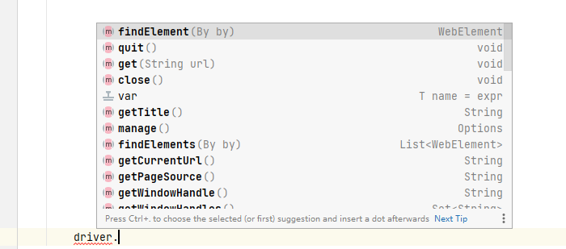

所有定位，都用这个findElement方法。不难看出，方法参数是一个By类型的对象。ide里写个By，然后ctrl+左键进去看一下：

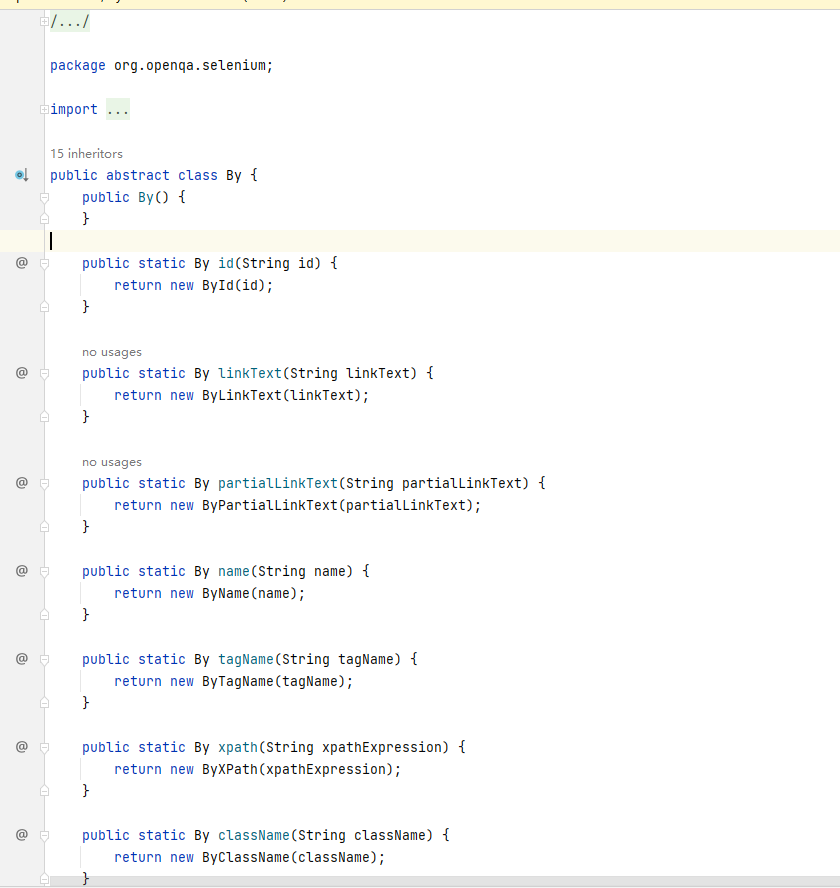

我们说的元素查找方式全在里面。看一下strucutre，是不是对上号了？

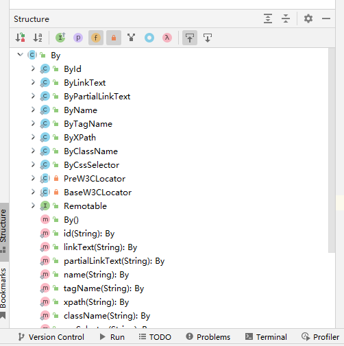

粗略看了一眼，By类是一个抽象类，By的具体实现应该是**静态内部类**实现的。以后分析。

找完了id，那还得接收他的对象吧。毕竟还需要对这些对象执行**click，sendkeys**等操作。我们用.var来看一下这个对象的名字是什么。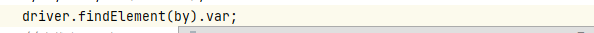

结果发现是WebElement接口，点进去，把方法看明白就行。

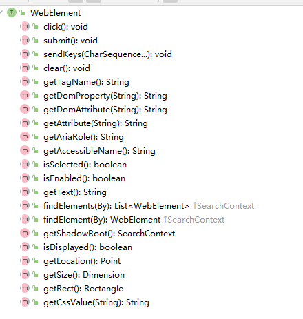

完整demo

```java
package scripts;

import org.junit.jupiter.api.Test;
import org.openqa.selenium.By;
import org.openqa.selenium.WebDriver;
import org.openqa.selenium.WebElement;
import org.openqa.selenium.chrome.ChromeDriver;

public class FindElementDemo {
    //通过
    @Test
    public void idTest() throws InterruptedException {
        //获取浏览器对象
        WebDriver driver = new ChromeDriver();
        //打开本地页面
        driver.get("C:\\Users\\18795\\IdeaProjects\\Selenium-Learning\\src\\test\\java\\resources\\注册A.html");
        //查找用户名元素
        By by = By.id("userA");
        WebElement username = driver.findElement(by);
        //查找密码元素
        WebElement password = driver.findElement(By.id("passwordA"));
        //用户名输入框，输入admin
        username.sendKeys("admin");
        //密码输入框，输入123456
        password.sendKeys("123456");
        //更直观地看见自动输入的流程
        Thread.sleep(10000);
        //关闭session
        driver.quit();
    }
}
```

链式写会更简洁。

### 3.2 name （元素属性）

name在html中可重复。

使用前提是元素得有name属性。

```java
	@Test
    public void nameTest() throws InterruptedException {
        WebDriver driver = new ChromeDriver();
        driver.get("C:\\Users\\18795\\IdeaProjects\\Selenium-Learning\\src\\test\\java\\resources\\注册A.html");
        driver.findElement(By.name("userA")).sendKeys("admin");
        driver.findElement(By.name("passwordA")).sendKeys("123456");
        Thread.sleep(1000);
        driver.quit();
    }
```

### 3.3 class_name （元素属性）

和name、id方式几乎一致

如果class有多个属性值，只能使用其中一个。

```java
	@Test
    public void classTest() throws InterruptedException {
        WebDriver driver = new ChromeDriver();
        driver.get(this.url);
        driver.findElement(By.className("telA")).sendKeys("18611111111");
        /*driver.findElement(By.className("emailA")).sendKeys("anicaazhu@gmail.com");*/
        Thread.sleep(1000);
        driver.quit();
    }
```

### 3.4 tag_name （标签名称）

和class的缺陷是差不多的。一个html里可能有重名。而且几乎必然有重名标签。这种情况下，我们永远只能找到第一个tag。

当然还是有办法可以找到第二个相同类型的tag的。```driver.findElements(By by)```会返回一个list。list中装了html中，所有与查找的类型相同的标签。list.get(int index)就能获取到具体的标签，从上往下，通常是。

```java
	@Test
    public void tagNameTest() throws InterruptedException {
        WebDriver driver = new ChromeDriver();
        driver.get(this.url);
        driver.findElement(By.tagName("input")).sendKeys("TagName Test");
        driver.findElements(By.tagName("input")).get(1).sendKeys("Second Input Tag Test");
        Thread.sleep(1000);
        driver.quit();
    }
```

### 3.5 link_text （<a>超链接）

文本必须为全部匹配

必须只能定位a标签

```html
<a>aaaa</a>
```

匹配的就是这个”aaaa'

```java
	@Test
    public void linkTextTest() throws InterruptedException {
        WebDriver driver = new ChromeDriver();
        driver.get(this.url);
        driver.findElement(By.linkText("访问 新浪 网站")).click();
        Thread.sleep(1000);
        driver.quit();
    }
```

### 3.6 partial_link_text (<a>超链接，模糊查找)

和link_text唯一区别就是可以模糊查。

模糊查并不是出现过相同字符就可以。必须是**缺少**才行。这么说可能有点抽象，举个例子：

> 我们要找的linktext是 “aaaaa".
>
> 那么。partialLinkText可以为“aaaaa"(完全一致)，也可以为"a", "aaa", "aa", "aaaa". 但是，不可以是“aaaaaa"或”aab"这种。

```java
	@Test
    public void partialLinkTextTest() throws InterruptedException {
        WebDriver driver = new ChromeDriver();
        driver.get(this.url);
        //driver.findElement(By.linkText("访问 新浪 网站")).click();//完全一致是可以的
        //driver.findElement(By.partialLinkText("访问 新浪网站")).click();//不可以
        driver.findElement(By.partialLinkText("访问")).click();//可以
        Thread.sleep(1000);
        driver.quit();
    }
```

### 3.7 XPath （基于元素路径）

之所以用XPath和CSS，是因为万一**前六种情况都不能用**，就白瞎了。

比如这种情况

```<input type="submit" value="提交" />```

没有id，没有name，没有class。

tag吧，万一他不是该页面第一次出现的，也不好找。

link_text和partiall_link_text，专门给a标签用的，input不对口。

所以只能能用XPath和CSS方法来定位。


> XPath是 XML Path的简称。它是一门在XML文档中查找元素信息的语言。
>
> HTML可以看作是XML的一种。所以Selenium用户可以使用这种强大的语言的Web应用中定位元素。
>
> 各种文件的作用：
>
> * XML的重点在于数据的存储和传递。常用于软件配置。
> * HTML显示元素
> * CSS控制显示元素的样式

XPath偷懒，不手写：

​	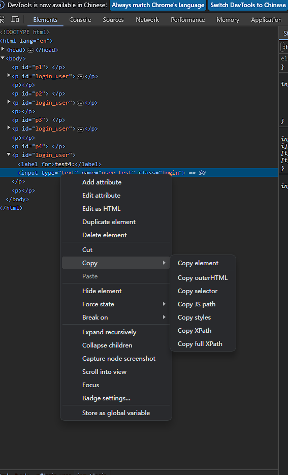

#### 3.7.1 路径定位：绝对路径

> 必须从html开始。格式：```/html/.../...```

#### 3.7.2 路径定位：相对路径

> 必须以```//元素名```开头
>
> 不知道元素名，用*代替
>
> 开发时建议相对路径：如果层级变化，绝对路径大概率会失效。

```java
	@Test
    public void xPathTest() throws InterruptedException {
        WebDriver driver = new ChromeDriver();
        driver.get(url);
        //1.使用绝对路径获取username输入框
        String absPath = "/html/body/form/div/fieldset/p[1]/input";
        driver.findElement(By.xpath(absPath)).sendKeys("admin");
        Thread.sleep(1000);
        //2.使用相对路径获取username输入框
        String relativePath = "//p[@id='p1']/input";//
       //p[@id="p1"]/input  这样可以    //*[@id="userA"]也可以  注意java“”中的“”要用\\隔开。即\"p1\"，当然也可以用单引号代替
        driver.findElement(By.xpath(relativePath)).sendKeys("123456");
        Thread.sleep(1000);
        driver.quit();
    }
```

#### 3.7.3 XPath扩展

> 对于被标签夹着的文本。可以用```//*[text()='字符']```来定位

> 对于属性中含有xxx元素，可以用//```*[contains(@attribute, '属性名')]```. 属性名可以模糊。
>
> 对于属性以xxx开头的元素，可以用```//*[start-with(@属性类型, '属性名')]```. 可以模糊。

### 3.8 CSS （元素选择器）

#### 3.8.1 id选择器

根据id属性名来选择

格式：#属性名

#### 3.8.2 class选择器

根据class属性名来选择

格式：.属性名

#### 3.8.3 元素选择器

根据元素的标签名称来选择

格式：标签名

#### 3.8.4 属性选择器

格式[属性=‘属性名’] 

e.g. [id='passwordA']

#### 3.8.5 层级选择器

```>```找直接子集，只能找下一级

```空格```找后代

```java
	@Test
    public void cssSelectorTest() throws InterruptedException {
        WebDriver driver = new ChromeDriver();
        driver.get(url);
        driver.findElement(By.cssSelector("#userA")).sendKeys("admin");//通过id选择器，定位用户名，输入admin
        driver.findElement(By.cssSelector("[id='passwordA']")).sendKeys("123456");//通过属性选择器，定位密码框，输入123456
        driver.findElement(By.cssSelector(".telA")).sendKeys("110");//通过class选择器，定位手机号，输入110
        System.out.println(driver.findElement(By.cssSelector("span")).getText());//定位span标签，获取文本值
        driver.findElement(By.cssSelector("p>input[type='emailA']")).sendKeys("123@qq.com");//通过层级标签，定位邮箱，输入123@qq.com
        Thread.sleep(1000);
        driver.quit();
    }
```

#### 3.8.6 CSS扩展

input[type^='p'] 以p开头的元素

input[type$='d'] 以d结尾的元素

input[type*='w'] 包含w的元素


## 4. 元素操作

### 4.1 元素操作常用方法 

 click( ) 单击元素

 clear() 清除文本

send_key(value) 输入文本

```java
package scripts;

import org.junit.jupiter.api.Test;
import org.openqa.selenium.By;
import org.openqa.selenium.WebDriver;
import org.openqa.selenium.WebElement;
import org.openqa.selenium.chrome.ChromeDriver;

public class emulateBrowserApi {
    private String url = "C:\\Users\\18795\\IdeaProjects\\Selenium-Learning\\src\\test\\java\\resources\\注册A.html";

    @Test
    public void elementOperations() throws InterruptedException {
        WebDriver webDriver = new ChromeDriver();
        webDriver.get(this.url);
        WebElement userA = webDriver.findElement(By.id("userA"));
        userA.sendKeys("admin");
        Thread.sleep(1000);
        webDriver.findElement(By.id("passwordA")).sendKeys("123456");
        Thread.sleep(1000);
        webDriver.findElement(By.xpath("//*[@id=\"telA\"]")).sendKeys("1861111111111");
        Thread.sleep(1000);
        webDriver.findElement(By.xpath("/html/body/form/div/fieldset/p[4]/input")).sendKeys("123@qq.com");
        Thread.sleep(1000);
        userA.clear();
        Thread.sleep(1000);
        userA.sendKeys("18600000000");
        Thread.sleep(1000);
        webDriver.findElement(By.xpath("//*[@id=\"zc\"]/fieldset/button")).click();
        Thread.sleep(1000);
        webDriver.close();
    }
}
```

文件上传案例：

```java
package scripts;

import org.junit.jupiter.api.Test;
import org.openqa.selenium.By;
import org.openqa.selenium.WebDriver;
import org.openqa.selenium.chrome.ChromeDriver;

public class FileUploadDemo {

    private String url = "C:\\Users\\18795\\IdeaProjects\\Selenium-Learning\\src\\test\\java\\resources\\注册A.html";


    @Test
    public void test() throws InterruptedException {
        WebDriver webDriver = new ChromeDriver();
        webDriver.get(url);
        //webDriver.findElement(By.xpath("/html/body/form/div/fieldset/form/input[7]")).click();//这样写是错误的
        webDriver.findElement(By.xpath("/html/body/form/div/fieldset/form/input[7]")).sendKeys("C:\\Users\\18795\\IdeaProjects\\Selenium-Learning\\src\\test\\java\\resources\\注册A.html");
        Thread.sleep(5000);
        webDriver.quit();
    }
}

```


 

### 4.2 操作浏览器常用方法

Selenium 4.0操作浏览器API变了。

```
//https://www.selenium.dev/documentation/webdriver/interactions/windows
```

```java
package scripts;

import org.junit.jupiter.api.Test;
import org.openqa.selenium.*;
import org.openqa.selenium.chrome.ChromeDriver;

public class BrowserOperations {
    private String url = "C:\\Users\\18795\\IdeaProjects\\Selenium-Learning\\src\\test\\java\\resources\\注册A.html";

    @Test
    public void testOps() throws InterruptedException{
        WebDriver webDriver = new ChromeDriver();
        webDriver.get(this.url);
        //https://www.selenium.dev/documentation/webdriver/interactions/windows
        WebDriver.Window window = webDriver.manage().window();
        window.maximize();//最大化窗口
        Thread.sleep(1000);
        window.setSize(new Dimension(300, 400));
        Thread.sleep(1000);
        window.setPosition(new Point(320, 450));
        Thread.sleep(1000);
        window.fullscreen();
        Thread.sleep(1000);
        webDriver.findElement(By.xpath("/html/body/form/div/fieldset/p[6]/a")).click();
        Thread.sleep(1000);
        webDriver.navigate().back();
        Thread.sleep(1000);
        webDriver.navigate().forward();
        webDriver.navigate().refresh();
        webDriver.close();
    }
}
```

注意，close永远是关闭主窗口。

```
	@Test
    public void test() throws InterruptedException{
        WebDriver webDriver = new ChromeDriver();
        webDriver.get(this.url2);
        webDriver.findElement(By.xpath("//*[@id=\"user\"]")).sendKeys("admin");
        Thread.sleep(1000);
        System.out.println("关闭主窗口之前的标题" +webDriver.getTitle());
        webDriver.navigate().refresh();
        webDriver.findElement(By.xpath("/html/body/form/div/fieldset/p[8]/a")).click();
        Thread.sleep(1000);
        webDriver.close();
        Thread.sleep(1000);
        webDriver.quit();
    }
```


### 4.3 获取元素信息

方法均来自于WebElement接口的对象。均以getXxx()开头。

```java
package scripts;

import org.junit.jupiter.api.Test;
import org.openqa.selenium.By;
import org.openqa.selenium.Dimension;
import org.openqa.selenium.WebDriver;
import org.openqa.selenium.WebElement;
import org.openqa.selenium.chrome.ChromeDriver;

public class ElementInfoDemo {
    private String url = "C:\\Users\\18795\\IdeaProjects\\Selenium-Learning\\src\\test\\java\\resources\\注册A.html";

    @Test
    public void test() {
        WebDriver webDriver = new ChromeDriver();
        webDriver.get(url);
        //1).获取用户名输入框的大小
        Dimension size = webDriver.findElement(By.xpath("/html/body/form/div/fieldset/p[1]/input")).getSize();
        System.out.println("Size: " + size.toString());
        //2).获取页面上第一个超链接的文本内容
        WebElement element = webDriver.findElement(By.xpath("/html/body/form/div/fieldset/p[6]/a"));
        String text = element.getText();
        System.out.println("超链接文本: " + text);
        //3).获取页面上第一个超链接的地址
        String href = element.getAttribute("href");
        System.out.println("超链接地址: " + href);
        //4).判断页面中的span标签是否可见
        WebElement span = webDriver.findElement(By.xpath("/html/body/form/div/fieldset/p[5]/span"));
        boolean displayed = span.isDisplayed();
        System.out.println(displayed ? "可见" : "不可见");
        //5).判断页面中取消按钮是否可用
        boolean enabled = webDriver.findElement(By.xpath("/html/body/form/div/fieldset/form/input[5]")).isEnabled();
        System.out.println(enabled ? "可用" : "不可用");
        //6).判断页面中'旅游'对应的复选框是否为选中的状态
        boolean selected = webDriver.findElement(By.xpath("/html/body/form/div/fieldset/form/input[3]")).isSelected();
        System.out.println(selected ? "选中" : "未选中");
        webDriver.quit();
    }
}

```


## 5. 鼠标和键盘操作

### 5.1 鼠标操作

> 鼠标操作官方文档： https://www.selenium.dev/documentation/webdriver/actions_api/mouse/

Actions对象的创建需要传入webdriver。

通过调用Actions对象方法，来编写鼠标操作

并用```perform()```来执行操作。

```java
package scripts;

import org.checkerframework.checker.units.qual.A;
import org.checkerframework.checker.units.qual.C;
import org.junit.jupiter.api.Test;
import org.openqa.selenium.By;
import org.openqa.selenium.WebDriver;
import org.openqa.selenium.WebElement;
import org.openqa.selenium.chrome.ChromeDriver;
import org.openqa.selenium.interactions.Actions;

public class MouseDemo {
    private String url = "C:\\Users\\18795\\IdeaProjects\\Selenium-Learning\\src\\test\\java\\resources\\注册A.html";


    @Test
    public void test() throws InterruptedException {
        WebDriver webDriver = new ChromeDriver();
        webDriver.get(url);
        WebElement element = webDriver.findElement(By.xpath("/html/body/form/div/fieldset/p[1]/input"));
        Actions actions = new Actions(webDriver).contextClick(element);//右键点击文本
        actions.perform();//执行该动作

        element.sendKeys("admin");
        Actions actions2 = new Actions(webDriver).doubleClick(element);
        actions2.perform();

        WebElement element1 = webDriver.findElement(By.xpath("/html/body/form/div/fieldset/button"));
        Actions actions3 = new Actions(webDriver).moveToElement(element1);//悬停
        actions3.perform();
        Thread.sleep(10000);
        webDriver.quit();
    }
}
```


拖拽操作demo：

将red区块覆盖掉green区块。

```
	@Test
    public void testDragAndDrop() throws InterruptedException{
        WebDriver webDriver = new ChromeDriver();
        webDriver.get(url2);
        WebElement red = webDriver.findElement(By.xpath("//*[@id=\"div1\"]"));
        WebElement green = webDriver.findElement(By.xpath("//*[@id=\"div2\"]"));
        Actions actions = new Actions(webDriver);
        actions.dragAndDrop(red, green);
        actions.perform();
        Thread.sleep(1000);
        webDriver.quit();
    }
```

上面demo是拖拽到指定目标的位置。如果想要单目标拖拽，可以使用

```actions.dragAndDropBy(Webelement element, int xOffset, int yOffset)```来实现拖拽。注意，在常见的图形api中，(0,0)这个坐标指的是屏幕的左上角。

拖拽的实现，其实可以细分成以下动作：

1. 鼠标悬停到指定区，
2. 按住鼠标左键
3. 将鼠标悬停到目标区块
4. 松开鼠标


### 5.2 键盘操作

Selenium的键盘操作全部封装在Keys这个enum类中。

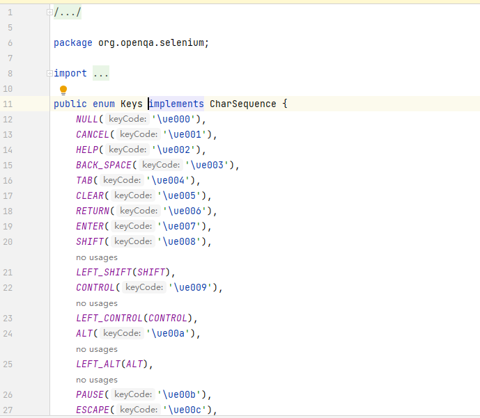

通过```webDriver.sendKeys(Keys.XXX)```来调用


Demo:

```java
package scripts;

import org.junit.jupiter.api.Test;
import org.openqa.selenium.By;
import org.openqa.selenium.Keys;
import org.openqa.selenium.WebDriver;
import org.openqa.selenium.WebElement;
import org.openqa.selenium.chrome.ChromeDriver;

import java.security.Key;

public class KeyBoardDemo {
    private String url = "C:\\Users\\18795\\IdeaProjects\\Selenium-Learning\\src\\test\\java\\resources\\注册A.html";

    @Test
    public void testCopyAndPaste() throws InterruptedException {
        WebDriver webDriver = new ChromeDriver();
        webDriver.get(url);
        WebElement usernameInput = webDriver.findElement(By.xpath("/html/body/form/div/fieldset/p[1]/input"));
        usernameInput.sendKeys("admin1");//输入admin1
        usernameInput.sendKeys(Keys.BACK_SPACE);//删除1
        usernameInput.sendKeys(Keys.CONTROL, "a");//全选
        usernameInput.sendKeys(Keys.CONTROL, "c");//复制
        WebElement passwordInput = webDriver.findElement(By.xpath("/html/body/form/div/fieldset/p[2]/input"));//找到密码框
        passwordInput.sendKeys(Keys.CONTROL, "v");//黏贴
        Thread.sleep(1000);
        webDriver.close();
    }
}
```

## 6.元素等待

> 可能有些环境（网络、本地、插件原因）浏览器加载速度比较慢。就会出现找不到元素的情况。从而导致脚本抛出异常
>
> 举个例子，往输入框里填写字符串的时候，可能浏览器还没加载出网页，那脚本自然也就找不到input元素了。
>
> 为了解决这个问题，我们如果捕获到异常，就进入等待。等网页加载出来，再试试。
>
> 具体一点，就是元素第一次未找到时，元素的等待就会被激活，如果在设置的有效时常内找到元素，则继续执行代码。如果超出设置的时常后仍未找到元素，则抛出异常。

### 6.1显示等待

> 定位指定元素时，如果能定位到元素则直接返回该元素，不触发等待； 如果不能定位到该 元素，则间隔一段时间后再去定位元素； 如果在达到最大时长时还没有找到指定元素，则抛出超 时异常 TimeoutException 。
>
> 只针对单个元素有效

官方文档：https://www.selenium.dev/documentation/webdriver/waits/#explicit-waits

```java
package scripts;

import org.junit.jupiter.api.Test;
import org.openqa.selenium.By;
import org.openqa.selenium.WebDriver;
import org.openqa.selenium.WebElement;
import org.openqa.selenium.chrome.ChromeDriver;
import org.openqa.selenium.support.ui.Wait;
import org.openqa.selenium.support.ui.WebDriverWait;

import java.time.Duration;

public class ExplicitWaitDemo {

    private String url = "C:\\Users\\18795\\IdeaProjects\\Selenium-Learning\\src\\test\\java\\resources\\注册A.html";

    @Test
    public void test() {
        WebDriver webDriver = new ChromeDriver();
        webDriver.get(url);
        Wait<WebDriver> wait = new WebDriverWait(webDriver, Duration.ZERO.withSeconds(10));
        WebElement element = wait.until(d -> d.findElement(By.id("userAA")));//故意写错的
        element.sendKeys("admin");
        webDriver.quit();
    }
}

```

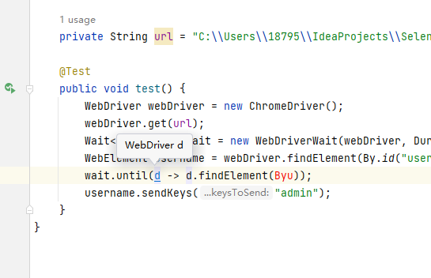

这里涉及到函数式变成。先知道这个d就是webDriver就可以。这个demo主要就是判断存不存在，存在就sendkey，不存在直接报错了。

因为我们用的是webDriver，所以wait的实现类就是这个WebDriverWait。可以看到的确实会报timeoutException。

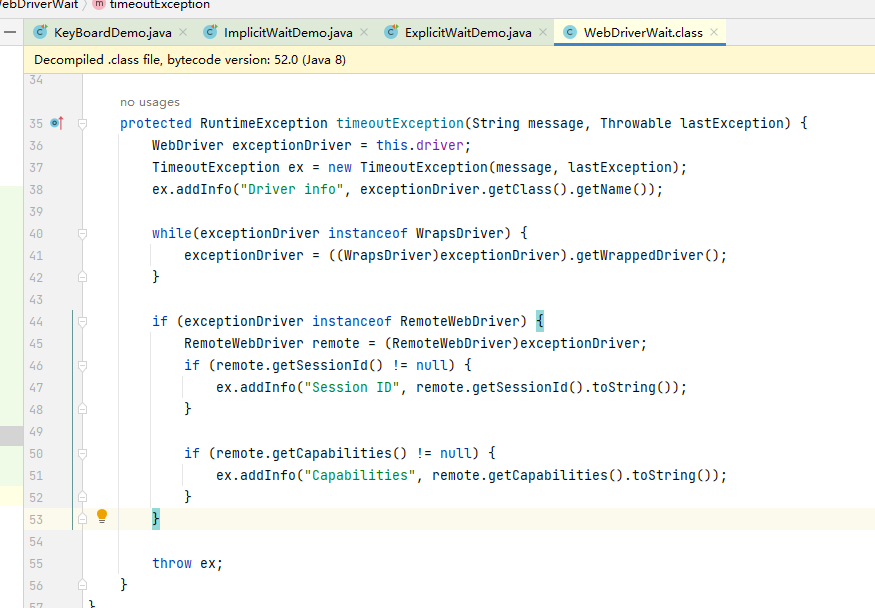

### 6.2隐式等待

> 定位元素时，如果能定位到元素则直接返回该元素，不触发等待； 如果不能定位到该元 素，则间隔一段时间后再去定位元素； 如果在达到最大时长时还没有找到指定元素，则抛出元素 不存在的异常 NoSuchElementException 。
>
> 隐式等待对所有元素都有效

```
package scripts;

import org.junit.jupiter.api.Test;
import org.openqa.selenium.By;
import org.openqa.selenium.WebDriver;
import org.openqa.selenium.chrome.ChromeDriver;

import java.util.concurrent.TimeUnit;

public class ImplicitWaitDemo {

    private String url = "C:\\Users\\18795\\IdeaProjects\\Selenium-Learning\\src\\test\\java\\resources\\注册A.html";

    @Test
    public void test() {
        WebDriver webDriver = new ChromeDriver();
        webDriver.get(url);
        webDriver.manage().timeouts().implicitlyWait(10, TimeUnit.SECONDS);
        webDriver.findElement(By.xpath("aaa"));
        webDriver.quit();
    }
}

```

可以把```webDriver.manage().timeouts().implicitlyWait(10, TimeUnit.SECONDS);```注释掉，对比一下，是不是真的等了10秒钟。

implicitlyWait这个参数有两种。一种是Duration对象，一种是(long time, TimeUnit timeunit)。后者，也就是demo中的写法已经是deprecated的了。

## 7. 下拉选择框

html下拉框是```<select>```元素

```java
package scripts;

import org.junit.jupiter.api.Test;
import org.openqa.selenium.By;
import org.openqa.selenium.WebDriver;
import org.openqa.selenium.chrome.ChromeDriver;
import org.openqa.selenium.support.ui.Wait;
import org.openqa.selenium.support.ui.WebDriverWait;

import java.time.Duration;

public class SelectDemo {
    private String url = "C:\\Users\\18795\\IdeaProjects\\Selenium-Learning\\src\\test\\java\\resources\\注册A.html";

    @Test
    public void test() throws InterruptedException {
        //这四行是公式
        WebDriver webDriver = new ChromeDriver();
        webDriver.manage().window().maximize();
        Wait<WebDriver> wait = new WebDriverWait(webDriver, Duration.ofSeconds(10));
        webDriver.get(url);
        webDriver.findElement(By.xpath("/html/body/form/div/fieldset/p[11]/select/option[2]")).click();
        Thread.sleep(5000);
        webDriver.quit();
    }

}

```

### 7.1 Select类

如果每次都用cssSelector来对select标签进行定位的话，太麻烦。Selenium为select标签定位提供了Select类封装，直接操作Select标签。

select类创建时需要将select标签的webelement作为参数传进去。

具体看注释。写的很清楚了

```java
	@Test
    public void testSelectClass() throws InterruptedException {
        WebDriver webDriver = new ChromeDriver();
        webDriver.manage().window().maximize();
        webDriver.manage().timeouts().implicitlyWait(Duration.ofSeconds(10));
        webDriver.get(url);
        WebElement selectTag = webDriver.findElement(By.xpath("/html/body/form/div/fieldset/p[11]/select"));
        Select select = new Select(selectTag);
        Thread.sleep(5000);
        select.selectByIndex(1);//从0开始
        Thread.sleep(5000);
        select.selectByValue("gz");//标签属性中的value
        Thread.sleep(5000);
        select.selectByVisibleText("A重庆");//开合标签夹着的文本
        Thread.sleep(5000);
        webDriver.quit();
    }
```


## 8. 弹出框

常用三种：

1. alert 警告框

2. confirm 确认框
3. prompt 提示框

处理方式都一样。

* 如果点击警告框后不处理，那么后面的操作都无法执行。

* 处理方法：
  1. 切换到对话框
  2. alert.text() / alert.dismiss() / alert.accept()

```java
package scripts;

import org.junit.jupiter.api.Test;
import org.openqa.selenium.Alert;
import org.openqa.selenium.By;
import org.openqa.selenium.WebDriver;
import org.openqa.selenium.chrome.ChromeDriver;
import org.openqa.selenium.support.ui.ExpectedCondition;
import org.openqa.selenium.support.ui.ExpectedConditions;
import org.openqa.selenium.support.ui.Wait;
import org.openqa.selenium.support.ui.WebDriverWait;

import java.time.Duration;

public class PopUpDemo {
    private String url = "C:\\Users\\18795\\IdeaProjects\\Selenium-Learning\\src\\test\\java\\resources\\注册A.html";

    @Test
    public void test() throws InterruptedException {
        //这四行是公式
        WebDriver webDriver = new ChromeDriver();
        webDriver.manage().window().maximize();
        webDriver.manage().timeouts().implicitlyWait(Duration.ofSeconds(10));
        webDriver.get(url);
        webDriver.findElement(By.xpath("/html/body/form/div/fieldset/form/input[6]")).click();//点击
        Thread.sleep(5000);
        Wait<WebDriver> wait = new WebDriverWait(webDriver, Duration.ofSeconds(10));
        wait.until(ExpectedConditions.alertIsPresent());//等代窗口跳出来 这里可以直接用Alert接受，那么下面一行就不用写了。同理，要写下行，其实这行就不用写了。这边单纯为了把两个方式都写一下。
        Alert alert = webDriver.switchTo().alert();//捕获alert
        System.out.println(alert.getText());
        alert.accept();
        Thread.sleep(5000);
        webDriver.quit();
    }
}

```

## 9. 滚动条操作
> 滚动条菜单使用场景
> 1. 在HTML页面中，由于前端技术框架的原因，页面元素为动态显示，元素根据滚动条的下拉而被加载 
> 2.  页面注册同意条款，需要滚动条到最底层，才能点击同意

```java
package scripts;

import org.junit.jupiter.api.Test;
import org.openqa.selenium.JavascriptException;
import org.openqa.selenium.JavascriptExecutor;
import org.openqa.selenium.WebDriver;
import org.openqa.selenium.chrome.ChromeDriver;

public class ScrollBarDemo {

    @Test
    public void test() throws InterruptedException{
        WebDriver webDriver = new ChromeDriver();
        webDriver.get("https://www.selenium.dev/documentation/legacy/selenium_2/faq/#q-how-do-i-execute-javascript-directly");
        JavascriptExecutor javascriptExecutor = (JavascriptExecutor) webDriver;
        Thread.sleep(5000);
        javascriptExecutor.executeScript("window.scrollTo(0,10000)");//0是x，10000
        Thread.sleep(5000);
        webDriver.close();
    }
}
```

## 10. Frame切换

> 官网文档： https://www.selenium.dev/documentation/webdriver/interactions/frames/

多种办法。swtich完了记得switch回来。

```java
package scripts;

import org.junit.jupiter.api.Test;
import org.openqa.selenium.By;
import org.openqa.selenium.WebDriver;
import org.openqa.selenium.chrome.ChromeDriver;

import java.time.Duration;

public class FrameDemo {
    private String url = "C:\\Users\\18795\\IdeaProjects\\Selenium-Learning\\src\\test\\java\\resources\\注册实例.html";

    @Test
    public void test() throws InterruptedException {
        WebDriver webDriver = new ChromeDriver();
        webDriver.get(url);
        webDriver.manage().timeouts().implicitlyWait(Duration.ofSeconds(10));

        WebDriver myframe1 = webDriver.switchTo().frame("myframe1");
        myframe1.findElement(By.xpath("/html/body/form/div/fieldset/p[1]/input")).sendKeys("admin");
        Thread.sleep(5000);
        myframe1.findElement(By.xpath("/html/body/form/div/fieldset/p[2]/input")).sendKeys("123456");
        Thread.sleep(5000);
        webDriver.switchTo().defaultContent();
        webDriver.findElement(By.xpath("/html/body/form/div/fieldset/p[1]/input")).sendKeys("admin1");//如果不swithc回default。那就一直卡在frame里了,会往frame里定位到的相同元素追加
        Thread.sleep(5000);
        myframe1.quit();
    }
}

```

## 11. 多窗口切换

三个api：

1. webDriver.switch().window(String handleName) 切换到指定句柄名的窗口
   * 之所以要切换，是因为如果切换到了新的窗口，想要操作新窗口的元素的话，就需要切换。有点类似上面的frame切换。
2. webDriver.getWindowHandle(); 返回字符串.   获取当前窗口句柄
3. webDriver.getWindowHandles(); 返回存储字符串的Set. 获取所有窗口句柄

代码注释很清楚了。

```java
package scripts;

import org.junit.jupiter.api.Test;
import org.openqa.selenium.By;
import org.openqa.selenium.WebDriver;
import org.openqa.selenium.chrome.ChromeDriver;

import java.time.Duration;
import java.util.Objects;
import java.util.Set;

public class WindowHandleDemo {

    private String url = "C:\\Users\\18795\\IdeaProjects\\Selenium-Learning\\src\\test\\java\\resources\\注册实例.html";

    @Test
    public void test() {
        WebDriver webDriver = new ChromeDriver();
        webDriver.get(url);
        webDriver.manage().timeouts().implicitlyWait(Duration.ofSeconds(10));
        webDriver.manage().window().maximize();

        //获取所有窗口句柄
        Set<String> windowHandles = webDriver.getWindowHandles();
        for (String s : windowHandles) {
            System.out.println(s);
        }
        String defaultHandle = webDriver.getWindowHandle();
        System.out.println(defaultHandle);// 两次结果应该一致，因为只有初始网页打开. 所以我们拿到了初始窗口的句柄


        webDriver.findElement(By.xpath("/html/body/form/div/fieldset/p[8]/a")).click();//点击超链接，打开新窗口
        windowHandles = webDriver.getWindowHandles();//重新获取所有句柄
        System.out.println(webDriver.getWindowHandle());//如果不进行切换的话，就算打开了新的窗口，当前窗口句柄依然是最初的
        //判断是否为新开窗口
        for (String s : windowHandles) {
            System.out.println(s);//此时会发现，除了3条主窗口句柄，还多了一个新的句柄
            //如果句柄不是主窗口，则切换
            if (!Objects.equals(defaultHandle, s)) {
                webDriver.switchTo().window(s);
            }
        }
        System.out.println(webDriver.getWindowHandle());//现在就切换到新窗口了
        webDriver.close();//先关掉新窗口
        webDriver.switchTo().window(defaultHandle);//回到初始窗口。
        webDriver.close();//关掉初始窗口。如果不先关新开窗口的话，新的窗口其实就一直不会关。可以注释掉代码看下
    }
}
```

## 12.截屏

```
package scripts;

import org.apache.commons.io.FileUtils;
import org.junit.jupiter.api.Test;
import org.openqa.selenium.OutputType;
import org.openqa.selenium.TakesScreenshot;
import org.openqa.selenium.WebDriver;
import org.openqa.selenium.chrome.ChromeDriver;

import java.io.File;
import java.io.IOException;

public class ScreenshotDemo {

    @Test
    public void test() throws InterruptedException, IOException {
        WebDriver webDriver = new ChromeDriver();
        webDriver.get("https://www.google.com");
        TakesScreenshot takesScreenshot = (TakesScreenshot) webDriver;
        File screenshot = takesScreenshot.getScreenshotAs(OutputType.FILE);
        //mvn 导入 common io的FileUtil
        FileUtils.copyFile(screenshot, new File("./resources/image.png"));
    }
}
```

Selenium入门完结。

-----

# Selenium 进阶

## 1. Selenium IDE

谷歌扩展里搜Selenium， 安装，打开。

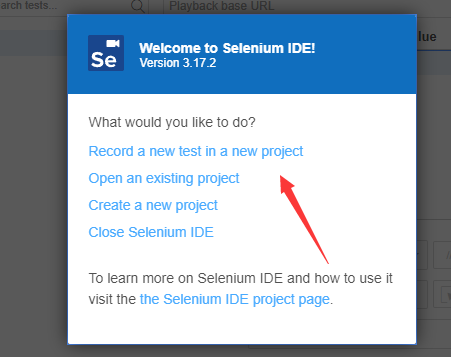

录制一个test。保存，自动执行。这样不用写一行代码，也能做同样的事情。

除了Selenium之外， 还有一个交Katalon Recorder， 也是做同样的事情。 

然后也可以将录制的test，导出成使用各种语言 + Selenium框架的成品代码。

## 2. Selenium细节

### 2.1 Grid & RC & WebDriver

Grid就是写好了测试脚本，在各个环境下（系统&浏览器）中执行。

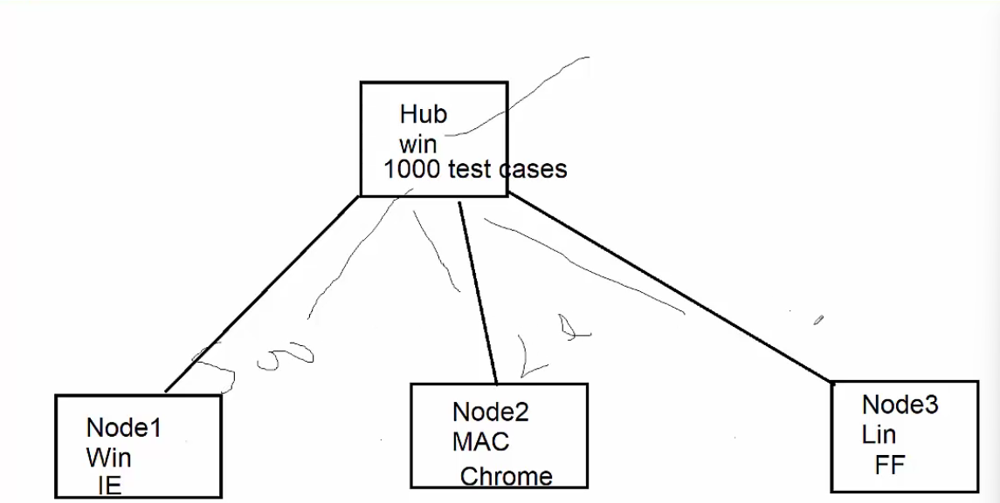

RC主要用于JS注入，是一个boarding lib

WebDriver各个浏览器不同。原生操作。


### 2.2 Selenium涵盖范围

Web  - WebDriver

Desktop based - WinAppDriver

Mobile App - Appnium


### 2.3 Selenium 版本迭代

#### 2.3.1 Selenium 1

IDE + RC + Grid

IDE提供录制， RC提供JS注入来控制浏览器操作， Grid负责自动执行。

#### 2.3.2 Selenium 2

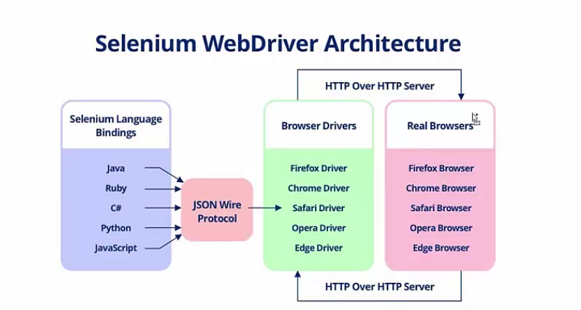

在IDE和RC的基础上新增了WebDriver。减少了很多原本的RC架构。提供多语言支持。WebDriver由浏览器官方提供，Selenium将使用各种语言写好的测试脚本转换成json，通过JSON WIRE协议， 发送给浏览器官方提供的WebDriver.

#### 2.3.3 Selenium 3 

没有RC， WebDriver + IDE + Grid 3

#### 2.3.4 Selenium 4

重做Grid。W3C兼容。稳定。
