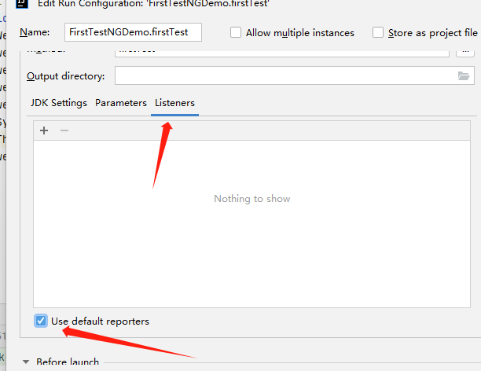

# TestNG
## 1. TestNG官方文档：
> https://testng.org/doc/documentation-main.html

## 2. 什么是TestNG？
> TestNG 是一个测试框架。用于unit（单元测试）、integration（集成测试）、end to end（端到端测试）以及function testing（功能测试.

* NG: next generation

* 目前学习TestNG主要还是为了以下几点：

  1. 批量进行测试用例管理和调度执行
  2. 生成报告。
  3. 结合PO设计模式进行Web自动化测试

* 博客： https://bbs.huaweicloud.com/blogs/300746

## 3. 第一个Selenium + TestNG测试案例

> 打开谷歌。在搜索栏填入信息，按下enter。

其实写法和JUnit是完全一样的。

```java
import org.openqa.selenium.By;
import org.openqa.selenium.Keys;
import org.openqa.selenium.WebDriver;
import org.openqa.selenium.chrome.ChromeDriver;
import org.testng.annotations.Test;

import java.time.Duration;

public class FirstTestNGDemo {

    @Test
    public void firstTest() throws InterruptedException{
        WebDriver webDriver = new ChromeDriver();
        webDriver.manage().window().maximize();;
        webDriver.manage().timeouts().implicitlyWait(Duration.ofSeconds(10));
        webDriver.get("https://www.google.com");
        webDriver.findElement(By.name("q")).sendKeys("www.anicaaz.com", Keys.ENTER);
        Thread.sleep(5000);
        webDriver.quit();
    }
}
```

### 3.1 默认测试报告




然后就能看到这个文件夹。里面这个emailable-report.html就是报告。


## 小问题：WebDriver成员变量

我们的测试类不可能永远只写一个方法。当存在多个方法时，我们想高效地利用WebDriver，比如保存WebDriver的状态，这样各个method就能衔接起来。

举个例子:

我们要测试登录qq账号以及发消息给好友。那第一个method就是登录。如果没有全局变量，那在登录里我们就要创建WebDriver对象，给url。登录method写完了，当写发消息时，我们得重新创建对象，给对应的url。很麻烦。有人说为什么不把两个方法和在一起，那样就太乱了。一个类不可能永远只写一个代码，这时候就需要将WebDriver设为成员变量。当你登录成功，那WebDriver就是跳转到好友列表时候的状态。这样就不用重新创WebDriver了

> 当然这是当前阶段的小问题。之后不可能这么些，因为这样还是很乱，封装的力度不够。


## 4. TestNG 常用注解

> 常用after/before Suite、class。after/before Test用的都算少了

下面有这么多，其实都大差不差。

@Before一般用于测试**环境准备**

@After一般用于**测试环境清理**


那么，我们想，当我们进行测试的时候，打开浏览器这个动作，其实跟测试内容的关系不是很大，是不是就是测试环境的准备？因此，我们可以用@BeforeClass，将其封装起来。

```
...

private WebDriver webDriver;
@BeforeClass
public void openBrowser() {
	//窗口、等待...etc..
	webDriver.getUrl();
}
```

### @Test

```java
import org.openqa.selenium.By;
import org.openqa.selenium.Keys;
import org.openqa.selenium.WebDriver;
import org.openqa.selenium.WebElement;
import org.openqa.selenium.chrome.ChromeDriver;
import org.testng.Assert;
import org.testng.annotations.AfterClass;
import org.testng.annotations.BeforeClass;
import org.testng.annotations.Test;

import java.time.Duration;

public class FindWebsite {
    private WebDriver webDriver;

    @BeforeClass
    public void openBrowser() {
        webDriver = new ChromeDriver();
        webDriver.manage().window().maximize();
        webDriver.manage().timeouts().implicitlyWait(Duration.ofSeconds(10));
    }

    //搜索www.anicaaz.com, 并判断第一条结果是否为“Kangwei Zhu's Blog: 首页”
    @Test (priority = 1)
    public void searchAnicaa() throws InterruptedException {
        webDriver.get("https://www.google.com");
        webDriver.findElement(By.name("q")).sendKeys("www.anicaaz.com", Keys.ENTER);
        System.out.println(webDriver.getTitle());
        WebElement element = webDriver.findElement(By.xpath("//*[@id=\"rso\"]/div[1]/div/div/div[1]/div/div/span/a/h3"));
        String text = element.getText();
        Assert.assertEquals(text, "Kangwei Zhu's Blog: 首页");
    }

    //跳转到www.anicaaz.com
    @Test (priority = 2)
    public void goToWebsite() throws InterruptedException {
        System.out.println(webDriver.getCurrentUrl());
        webDriver.findElement(By.xpath("//*[@id=\"rso\"]/div[1]/div/div/div[1]/div/div/span/a/h3")).click();
    }

    @AfterClass
    public void quitBrowser() {
        webDriver.close();
    }
}
```

在这个demo中，我们有两个**连续**的方法。搜索某网站时，肯定是先输入搜索内容，然后在从搜索结果里点击内容。但是，由于抢占问题，搜索结果这个步骤可能会优先执行，这样永远都是报错。因此，我们可以设置优先级。优先级默认值为0。优先级可以作用在类上，也可以作用在方法上。

如果你的测试不仅仅只是测试能否访问网页，可能还有别的目的的话，记得用Assert。因为可能网页跑通了，testng就认为你通过测试了，但是你的功能其实是有问题的。

此外，涉及到网页跳转的场景时，要注意别忘了隐式/显示等待。因为网页加载需要时间。有时候可能脚本执行得比加载速度快，从而导致找不到元素。

### @BeforeMethod

每个测试方法之前需要执行

### @AfterMethod

每个测试方法之后需要执行

### @BeforeClass

在当前类的第一个测试方法调用之前执行

### @AfterClass

在当前类的最后一个测试方法调用之后执行

### @BeforeTest

在当前类的第一个测试方法调用之前执行

### @AfterTest

在测试之后需要执行的

### @BeforeSuite

在测试之前需要执行的

### @AfterSuite

测试套件在执行之后需要执行的

第二个demo：

class1: 测试能否登录功能（这里选择谷歌账号）。

class2： 测试能否获取个人信息。

在这里，如果没有登录。是拿不到个人信息的。因为class2的运行会一直卡在登录页面（class2的```webDriver.get()```内参数是登录之后的主页url）。

要解决这个问题，就需要将class1中的WebDriver设为public static变量，方便调用。但是问题来了。你执行class2的时候，class1不可能一起执行啊。

```java
class1：
	private static WebDrvier webDriver;

class2:
	private WebDriver webDriver;
	@BeforeClass
	public void openBrowser() {
		webDriver = class1.webDriver;
	}
	
	..

```


因此WebDriver就变成了空指针。这时候，就需要用到suite来管理这些类了。

在TestNG中，最好一个类管理一个测试用例(具体还是看测试用例有多少），所有类（测试用例），则用suite管理。下面5.1.2会写道。


## 5. TestNG XML文件

### 1.1 TestNG XML文件的作用

XML是用来写配置的，TestNG的xml也不例外。 

在我们之前写过的所有demo中，每个测试类，大抵都只有一两个测试方法，我们只需要手动执行它。

但是，在项目中，我们通常会有几百上千个类和方法，这种情况下，我们如何去执行，执行哪些，以什么顺序去执行这些测试方法，就成了问题。

通过编写TestNG XML 文件，我们就可以很好的解决这个问题。

### 1.1.1 安装TestNG插件

idea -> plugin -> 搜索create testng xml

### 1.2 编写TestNG XML

xml名字任意，xml文件数量任意。但是通常命名为testng.xml

xml得放在resources里面

> Testng管理层级：
>
> suite->test->class->method

* testng.xml骨架

  ```xml
  <?xml version="1.0" encoding="UTF-8"?>
  
  <suite>
      <test>
          <classes>
              <class>
                  <methods>
                      
                  </methods>
              </class>
          </classes>
      </test>
  </suite>
  ```

  当然，手写很麻烦，可以直接通过testng插件生成。

### 1.3 XML DEMO

改造一下findWebsite，创建两个类。一个findWebiste，查找并进入www.anicaaz.com.另一个类findBlog，点击博客第一条。

FindWebsite改动


```java
import org.openqa.selenium.By;
import org.openqa.selenium.WebDriver;
import org.testng.Assert;
import org.testng.annotations.AfterClass;
import org.testng.annotations.BeforeClass;
import org.testng.annotations.Test;

public class FindBlog {

    private WebDriver webDriver;


    @BeforeClass
    public void setWebDriver() {
        webDriver = FindWebsite.webDriver;
    }

    @Test
    public void findBlog() {
        webDriver.findElement(By.xpath("/html/body/div/div[1]/div[2]/div[4]/div/div[1]/div[1]/div/div[2]/a/h1")).click();
        String text = webDriver.findElement(By.xpath("/html/body/div/div[1]/div[2]/div[4]/div/div[1]/div/h1")).getText();
        Assert.assertEquals(text, "速通TestNG");
    }

    @AfterClass
    public void closeWebDriver() {
        webDriver.close();
    }
}
```

```xml
<?xml version="1.0" encoding="UTF-8"?>
<!DOCTYPE suite SYSTEM "http://testng.org/testng-1.0.dtd">
<suite name="All Test Suite">
    <test verbose="2" preserve-order="true"
          name="查找网站">
        <classes>
            <class name="FindWebsite">
                <methods>
                    <include name="searchAnicaa"/>
                    <include name="goToWebsite"/>
                </methods>
            </class>
        </classes>
    </test>
    <test verbose="2" preserve-order="true"
          name="查找博客首页第一篇博客">
        <classes>
            <class name="FindBlog">
                <methods>
                    <include name="findBlog"/>
                </methods>
            </class>
        </classes>
    </test>
</suite>
```


把Assert内容随便乱改点，就可以看到成功的报错了。


## 6. PO模式与TestNG

其实就是把页面当成一个对象来看。一个类，对应一个页面。

PO： Page Object

抽象对象：

1. 属性： url 元素（元素定位表达式）
2. 方法： 业务流程操作。

高内聚: 页面属性放一块

低耦合：不同页面通过webDriver来传递


