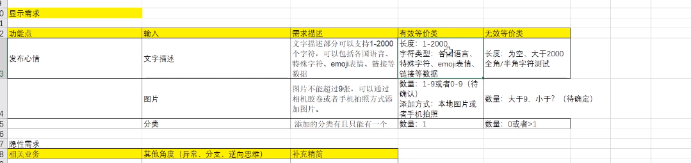

# 1. App 手工测试基础知识


# 1.1 App架构

* 基本和Web的后端服务器是相同的
  * 表示层 应用层 数据库

* 前后端也使用HTTP协议进行交互
* App中, 前后端传值以json为主. 而Web端既可以是json, 也可以是文本
  * KV
    * 因为App的前端是写死(hardcoded)在App中的

* APP是C/S结构,而Web浏览器是B/S结构
  * 新版本要升级,但是web不用


## 1.2 项目环境

* 开发环境
  * 开发人员进行开发时调试运行的环境
* 测试环境
  * 提供给测试人员使用,用于测试人员进行测试,回归缺陷
* 预发布环境
  * 连接到生产环境的数据库.使用生产环境的数据来进行测试
  * 和测试环境的数据相比,数据更复杂.
  * 涉及到写入数据库的业务操作时,只能用自己构造的数据.
* 生产环境
  * 正式提供对外服务的环境,产品的实际用户使用的环境


> 灰度发布: 先对部分机器投放版本更新, 如果反馈没问题, 再将剩余一起投放更新. 如果新功能存在问题,则只需要回滚投放更新的那几台.
>
> 投放策略: 比如选择尾号为0的用户进行投放.
>
> 注意点:
>
> 1. 灰度机器不能太多
> 2. 灰度时间一般在一周到一个约
> 3. 灰度发布时不能影响用户的使用.
> 4. 出现问题后,需要到测试环境里来复现问题. 如果问题非常严重, 则需要立马回滚


## 1.3 APP发布

APP开发完成后,开发人员会将其打包, 由测试人员安装测试

* 安卓: APK测试包
* IOS: IPA测试包


### 应用线上发布平台:

安卓: google store

IOS: App Store


## 1.4 敏捷开发

* 敏捷开发以用户的需求进化为核心,采用迭代,循序渐进的方法进行软件开发
* 项目被分为若个子项目, 各个自项目的成果都经过测试, 具备可视,可集成,可运行使用的特征.


### 1.4.1 瀑布模型

> 线性地进行项目

* 定义阶段
  * 可行性
  * 需求分析
* 开发阶段
  * 设计
  * 编码
  * 测试
* 维护阶段
  * 运行维护

缺点: 开发周期长,迭代速度慢


### 1.4.2 为什么采用敏捷开发

* 互联网行业发展速度快,需求不断变化,产品更新迭代的频率高

* 试错快

```
代表性的敏捷开发模型: Scrum
```


### 1.4.3 Scrum

> 一个增量的, 迭代的开发过程. 在这个框架中,整个开发周期包括**若干个小的迭代周期.** 每个小的迭代周期被称为一个**Sprint**. 每个Sprint周期建议为**2~4周**. 在Scrum中,将产品Backlog(任务待办列表),按商业价值进行排序. 挑选出最有价值的需求进行开发, 开发完成后将产品推进市场,进行下一个版本的迭代.


三种角色

* Product Owner
  * 定义产品功能, 决定发布内容和日期, 根据市场的变化对需要开发的功能排列优先顺序

* Scrum Manager
  * 确保团队不受外界影响
  * 确保团队生产率

* Dev Team
  * 程序员\测试员\用户体验设计师
  * 主要职责是实现用户需求


开发流程:

收集需求, 生成产品功能列表

计划会: 确定优先级高的功能: 市场需求, 存在缺陷

进行迭代(小瀑布)


# 2. App测试流程

1. 参与需求评审
2. 制定测试计划: 项目的功能模块, 负责人, 环境,
3. 设计编写测试用例: 根据需求编写用例, 评审用例, 紧张的话,就写测试点就行了.
4. 执行用例,跟踪缺陷 : JIRA
5. 版本测试报告: 测试的模块,用例数, 发现的bug,遗留的bug


## 2.1 测试之前需要了解什么

1. 项目的作用
2. 了解项目的目标用户和角色
3. 了解项目的功能
4. 了解项目的技术架构


## 2.2 APP测试要点

对于APP项目的测试,一般是进行系统测试

而系统测试主要包含:

1. 功能测试(重点)
2. 兼容性(不同系统, 不同厂商的手机)
3. 安装\卸载\升级测试(因为是C\S 结构)
4. 交叉事件测试(被其他事件被打断了)
5. PUSH测试(弹出某个消息提示后)

6. 性能测试(CPU\内存\流量\电量\流畅度\启动速度)
7. 用户体验测试
8. 稳定性测试 (运行时常,会不会崩)


**显式需求**

根据软件说明,设计文档,或用户需求验证App的各个功能的实现


**隐式需求**

被功能影响到的相关业务


## 2.3 功能测试实践




