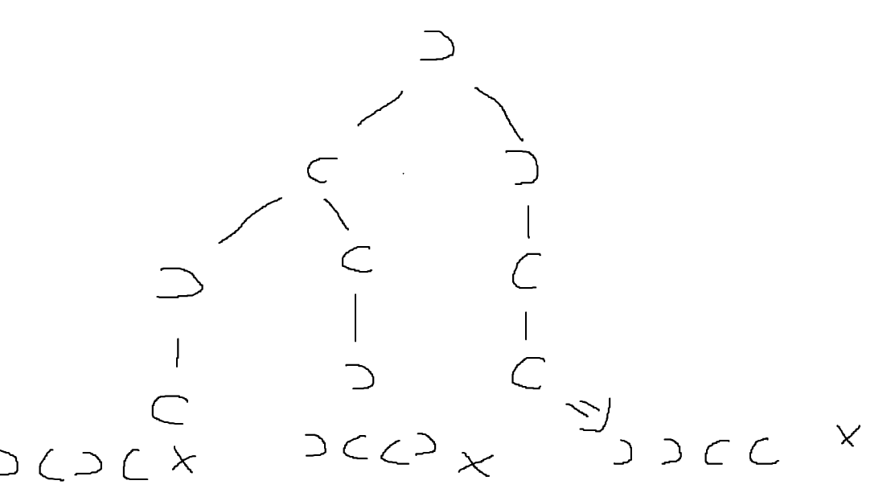

> 金鱼似的大脑实在是容纳不了太长的记忆曲线:fish:. 这几天在回顾前面刷的前150道LC, 发现除了easy以外的,还有少数medium, 其他的要么不是bug free要么就是完全没头绪. 从今天开始, :calendar:每天保持至少1题LC + 解析, 方便日后重新捡起.

 

## 1/8/2024
### 22. Generate Parentheses
> 回溯的题， 题意非常简单。给定 n组 括号， 输出所有 well-formed 括号的组合。
首先需要注意的就是**well-formed**的定义。 well-formed指的是 **左括号在前，右括号在后”** 的组合方式，给了多少组括号，则这些括号都需要满足这种组合方式。

答案以List形式输出。

下面是两个简单例子。
```
n = 1, output = ["()"]
```
```
n = 2, output = ["(())", "()()"]
```

第一个例子其实不能看出什么规律，我们看下第二个例子的图解。

这是第一种情况，以左括号)开始，有以上三种情况。


第二种情况，以右括号)开始，两种情况。

从这两张图，我们已经足够推出规律了：
    1. 首先，永远只有两种开始情况： 左括号开始和右括号开始。
    2. 一旦路径上的 右括号数量 比 左括号数量大， **哪怕就多一个**，其实这条路径就没有走的意义了，必然不可能是 well-formed.
    3. 在第二条的前提下，如果能够走到 左括号和右括号用尽的情况，就是我们想要的一个答案了。
    4. 根据第二条，我们可以看出， **左括号的优先级最大**， 我们尽可能地先用完左括号，然后去看右括号号的情况。
    5. 用尽左括号的时候，先补全右括号，然后返回到 **最早使用过左括号的那一层**， 选择用右括号开始，往下走，尝试用尽左括号。遇到走不通的，就回到最早使用过左括号的那一层，换右括号。
    6. 不善表达。如果看到这里还是比较迷糊的话，可以跳过代码，先看看对我对回溯的理解。这样以后做到类似理念的题目，也能联想到回溯。

``` java
class Solution {
    public List<String> generateParenthesis(int n) {
        List<String> res = new ArrayList<>();
        backtracking(0, 0, "", n, res);
        return res;
    }
    
    public void backtracking(int left, int right, String str, int number, List<String> res) {
        if (right > left) {
            return;
        }

        if (right == number && left == number) {
            res.add(str);
            return;
        }

        //  加左括号
        if (left < number) {
            backtracking(left + 1, right, str + "(", number, res);
        }

        // 加右括号
        if (right < left) {
            backtracking(left, right + 1, str + ")", number, res);
        }
    }
}
```

>**讲一下我对回溯的理解**：回溯就像是，当你走到了一个交叉路口，需要选择走哪一边的时候。无论你选择走哪一边，都会经历一系列事情，可能在这些事情里，你还会遇到更多的交叉路口，做出更多的决策。不管是你最后通关，还是失败，**你都会决定回到先前的路口，走另外一边，尝试另一种可能。对于每个路口，都是如此**。这就是回溯。

---

## 2/13/2024

> 正月初四了，原来已经一个月没有碰题目了，今天也是磨蹭着补了4道题。

### 每日一题：[2108. Find First Palindromic String in the Array](https://leetcode.com/problems/find-first-palindromic-string-in-the-array/)

```java
class Solution {
    public String firstPalindrome(String[] words) {
        for (int i = 0; i < words.length; i++) {
            if (isPalindrome(words[i])) {
                return words[i];
            }
        }
        return "";
    }

    public boolean isPalindrome(String word) {
        char[] ch = word.toCharArray();
        int left = 0;
        int right = ch.length - 1;
        boolean res = true;
        while (left < right) {
            if (ch[left] == ch[right]) {
                left++;
                right--;
            } else {
                res = false;
                break;
            }
        }
        return res;
    }
}
```

### [15. 3Sum](https://leetcode.com/problems/3sum/)
```java
class Solution {
    public List<List<Integer>> threeSum(int[] nums) {
        List<List<Integer>> res = new ArrayList<>();
        Arrays.sort(nums);
        for (int i = 0; i < nums.length; i++) {
            if (i > 0 && nums[i - 1] == nums[i]) {
                continue;
            }

            int left = i + 1;
            int right = nums.length - 1;

            while (left < right) {
                int sum = nums[i] + nums[left] + nums[right];
                if (sum > 0) {
                    right--;
                } else if (sum < 0) {
                    left++;
                } else {
                    res.add(Arrays.asList(nums[i], nums[left], nums[right]));

                        while (left < right && nums[left] == nums[left + 1]) {
                        left++;
                    }

                    while (left < right && nums[right] == nums[right - 1]) {
                        right--;
                    }

                    left++;
                    right--;
                }
            }
        }
        return res;
    }
}
```
### [16. 3Sum Closest](https://leetcode.com/problems/3sum-closest/)
```java
class Solution {
    public int threeSumClosest(int[] nums, int target) {
        Arrays.sort(nums);
        int closestSum = nums[0] + nums[1] + nums[2];
        for (int i = 0; i < nums.length; i++) {
            int left = i + 1;
            int right = nums.length - 1;
            while (left < right) {
                int sum = nums[i] + nums[left] + nums[right];
                if (Math.abs(target - sum) < Math.abs(target - closestSum)) {
                    closestSum = sum;
                }   
                if (sum > target) {
                    right--;
                } else {
                    left++;
                }
            }
        }
        return closestSum;
    }
}
```
### [18. 4Sum](https://leetcode.com/problems/4sum/)
```java
class Solution {
    public List<List<Integer>> fourSum(int[] nums, int target) {
        List<List<Integer>> res = new ArrayList<>();
        Arrays.sort(nums);
    
        for (int i = 0; i < nums.length; i++) {
            if (i > 0 && nums[i] == nums[i - 1]) {
                continue;
            }
            for (int j = i + 1; j < nums.length; j++) {
                if (j > i + 1 && nums[j] == nums[j - 1]) {
                    continue;
                }
                int right = nums.length - 1;
                int left = j + 1;
                while (left < right) {
                    long sum = (long)nums[i] + nums[j] + nums[left] + nums[right]; // leetcode用例存在数据之和超过int最大值。
                    if (sum == target) {
                        res.add(Arrays.asList(nums[i], nums[j], nums[left], nums[right]));
                        while (left < right && nums[left] == nums[left + 1]) {
                            left++;
                        }
                        while (left < right && nums[right] == nums[right - 1]) {
                            right--;
                        }
                        right--;
                        left++;
                    } else if (sum < target) {
                        left++;
                    } else {
                        right--;
                    }
                }
            }
        }
        return res;
    }
}
```

这三题可以一块看。15题是这种类型的模板。
题目都是给定一组 **乱序int数组** 和一个 **target**值， 然后围绕 **指定数量的，数组下标不同的，元素之和** 与 target之间的关系来展开题目。 

对于这种题目，模板非常简单，往往以下几步就可以解决。
1. 数组排序
2. 第一层循环，锁死一个数，对这个数进行去重。以3sum为例， 直接锁死下标0的元素， 首先对其进行去重，比如[-1, -1, 0, 1, 2] , 我们不想看到[-1,0,1]这个结果, 在结果集中出现两次。
3. 锁死一个下标的数之后，左指针指向这个数字右侧的一个数，右指针指向数组末尾。
4. 再套一层循环，判断当前这个三个下标（锁死的下标，左指针，右指针）的数之和与target关系。 三种情况，分别讨论，同时做左指针和右指针所指向的数字的去重。

有了这个模板之后，其实无论是3sum， 4sum， 5sum，都是一样的做法。不过这个规律其实从2sum开始就存在了，但是2sum没有3sum那几步额外操作。

## 2/14/2024

### 每日一题：[2149. Rearrange Array Elements by Sign](https://leetcode.com/problems/rearrange-array-elements-by-sign/)

```java
class Solution {
    public int[] rearrangeArray(int[] nums) {
        int posI = 0;
        int negI = 1;
        int[] res = new int[nums.length];
        for (int num : nums) {
            if (num > 0) {
                res[posI] = num;
                posI += 2;
            } else {
                res[negI] = num;
                negI += 2;
            }
        }
        return res;
    }
}
```

94.