## 1. 主流测试技术

### 1.1 功能测试

> 验证程序的功能是否能满足需求

### 1.2 自动化测试

> 使用代码或工具代替手工，对项目进行测试

### 1.3 接口测试

> 测接口。

### 1.4 性能测试

> 模拟多人使用软件，查找服务器缺陷。

## 2.测试分类

### 2.1 按测试阶段划分

> 单元、集成、系统、验收

单元：针对源代码测试（开发自己做）

集成：接口测试。针对模块之间访问进行测试。

系统：对整个系统进行测试。（功能、兼容、文档等测试）

验收：内测、公测。不同人群对项目提供反馈。

### 2.2 按代码可见度划分

#### 2.2.1 黑盒测试

属于系统测试

1. 源代码不可见
2. UI可见

#### 2.2.2 灰盒测试

属于接口测试（集成测试）

1. 部分源代码可见

2. 功能不可见（只有纯接口）

#### 2.2.3 白盒测试

属于单元测试

1. 源代码完全可见
2. UI不可见

## 3. 质量模型

> 质量模型用于衡量一个优秀软件的维度。

* 功能性
* 性能：每秒请求数 <= 服务器硬件是否满足
* 兼容性：多平台。浏览器、操作系统、分辨率、网络、应用之间
  
* 易用性：简洁、友好、流畅、美观
* 可靠性：卡顿、服务器宕机、闪退
* 安全：信息传输，存储。加密。
* 可维护性
* 可移植性

## 4. 测试流程

1. 需求评审
   确保各部门需求理解一致
2. 计划编写
   测什么、谁来测、怎么测、
3. 用例设计
   验证项目是否符合需求的操作文档
4. 用例执行
   项目模块开发完成后，执行用例文档，实施测试
5. 缺陷管理
   对缺陷进行管理
6. 测试报告
   实施测试结果文档

## 5. 测试用例

> 用例：用户使用的案例。
>
> 测试用例：为测试项目而设计的执行文档

### 5.1 测试用例的作用

1. 防止漏测
2. 实施测试的标准

### 5.2 用例设计编写格式

八大要素：用例编号，用例标题，项目/模块，优先级，前置条件，测试步骤，测试数据，预期结果

* 用例编号: 项目_ 模块 _编号

* 用例标题：预期结果（测试点）
* 项目/模块：所属项目或模块
* 优先级：表示用例的重要程度或影响力。从p0到p4。最高为p0
  * 核心功能：用户、高频
* 前置条件：要执行词条用力，有哪些前置操作
  * 测试登录：先要打开登录页面，才能。。。
* 测试步骤：描述操作步骤
* 测试数据：操作的数据，没有的话可以为空
* 预期结果：期望达到的结果

demo:

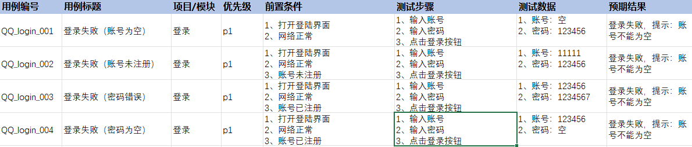

#### 5.2.1 Excel下拉复制的同时使数字不会自增

按住ctrl然后下拉

## 6. 等价类划分法

> 在所有的测试数据中，具有某种共同特种的数据集合进行划分。划分之后的结果分为两类：
>
> * 有效等价类：满足需求的数据集合
>   * 需求：统计出生时性别为男孩的人数。则所有新生儿中男孩为有效
> * 无效等价类：不满足需求的数据结合
>   * 上面例子中的女孩。

### 6.1 Demo：验证账号的合法性

* 需求：账号长度需要是6~ 10位自然数

步骤：

1. 明确需求
   * 账号长度需要是6~ 10位自然数
2. 划分有效等价类
   * 有效：八位
   * 无效：三位、十二位
3. 提取数据，编写用例
   * 八位：12345678
   * 三位：123
   * 十二位：123456789012

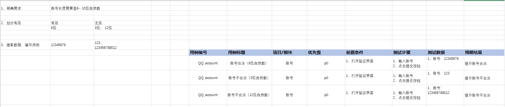

#### 6.1.1 根据类型完善

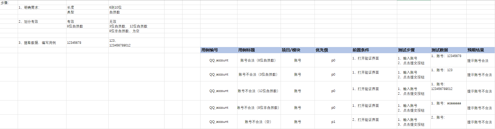

> 需求最多也就可以被分成：长度、类型、规则

### 6.2 Demo：电话号码

要求：

1. 区号：空或者是三位数字
2. 前缀码：非"0"且非"1"开头的三位数字
3. 后缀码：四位数字

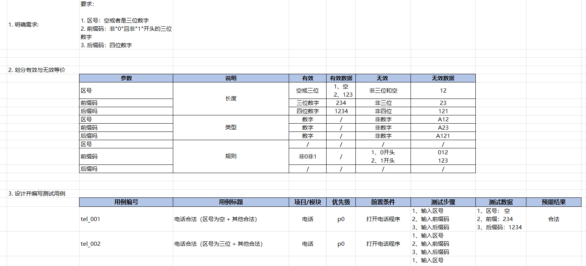

### 6.3 等价类适用场景

需要有大量的数据测试输入，但是没法穷举测试的地方

* 输入框
* 下拉列表
* 单选、复选框

## 7. 边界值分析方法

### 7.1  边界范围节点

* 选择**正好等于**、**刚好大于**、**刚好小于**边界的值作为测试数据
  * 上点： 边界**上**的点（正好等于)
  * 离点： 距离上点距离最近的点（刚好大于**、**刚好小于)
  * 内点： 范围内的点（一般取中间的）
* 这样算下来。最多7条。（两个商店，四个离点，一个内点）
* 注意：内点需要两条用例（正反）
* Demo：等价类和边界值合一块写
  * 要求：账号长度需要是6到10位自然数（6和10也可以）
    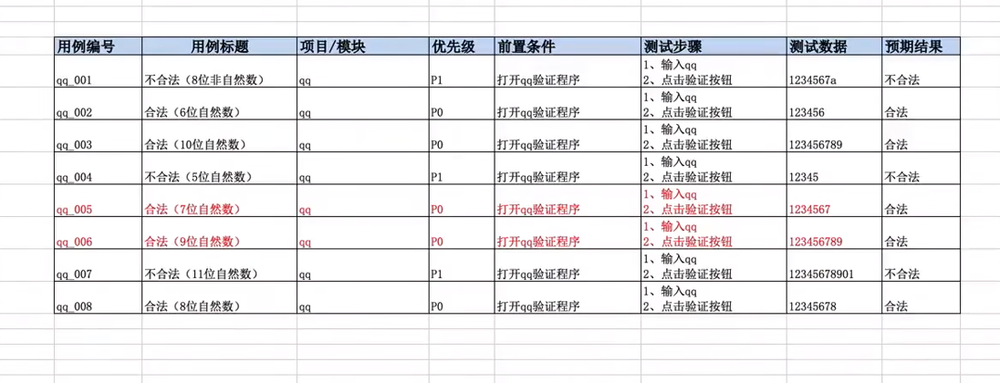

* 从这个例子不难看出。其实等价类的分析：长度、类型、规则，其实结合了边界值之后，**长度，规则**这两点就交给边界值分析了。比如对要求账号是6到10位，那么有效等价就是自然数，无效等价就是非自然数。而原先哪些长度，规则，就由边界值进行判定。

### 7.2 优化

**开内闭外**：开区间选内点，闭区间选外点

开区间：边界点**没有等号**   （如大于0小于10）

闭区间：边界上的点有等号（如大于等于0小于等于10)

那么可以看到上面的案例中，因为6和10时包含的，那么属于双闭，选外点。那么内点7和9就不需要了。数量优化到5点。

## 8. 判定表

> 很多场景，用例存在**条件依赖**关系。比如欠费就停机。这时候就无法单一地去测了。

* 等价类以及边界值更加关注**单个输入类条件**的测试
* 并未考虑输入条件之间的组合，输入条件和输出结果之间的依赖关系。

判定表：以表格的形式表达 多条件逻辑判断 的工具

* 组成：
  1. 条件桩：列出问题中的所有条件。次序是无关紧要的
  2. 动作桩：列出问题中可能采取的操作。操作的顺序同样无关紧要
  3. 条件项：条件的取值
  4. 操作：条件叠加后的结果

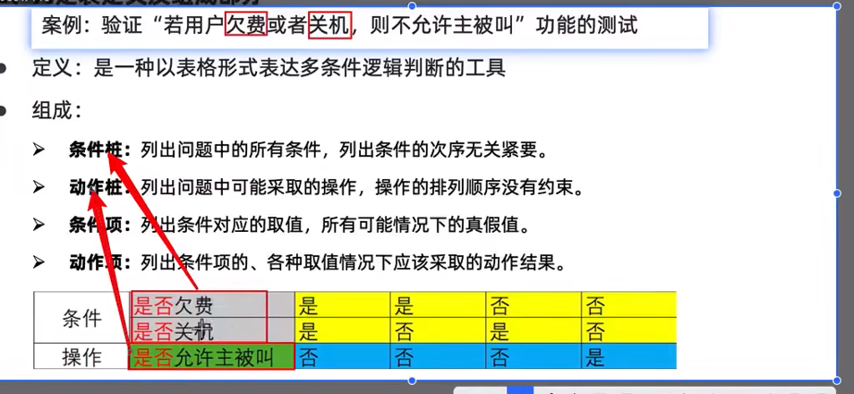

* 假设有n个条件，每个条件取值有m个，全部组合就有m的n次方种规格。当然，绝大多数的情况下，条件的取值有2个
* 像上图这样把表格整理出来后，每一列都是一个用例。

* 判定表一般适用于条件少于4个的情况，如果条件多于4个，就要用正交表了。

## 9. 业务覆盖测试

###  9.1 流程图

> 业务用例是根据流程图来梳理的

**开始和结尾**用椭圆。

**中间**用**判断语句**连接。菱形

**判断语句**连接结果。

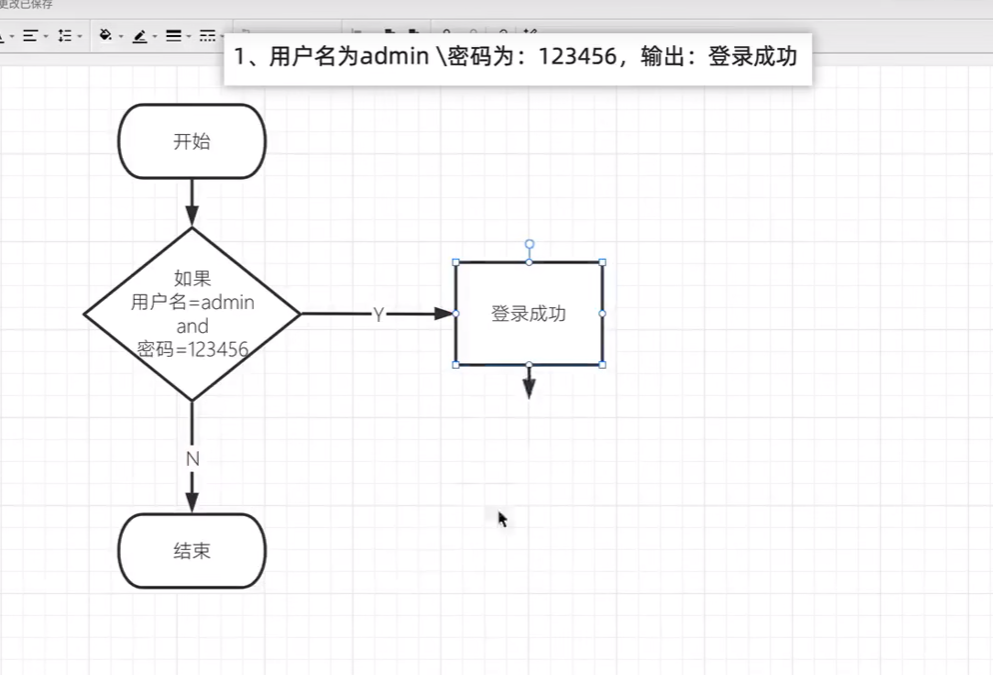

### 9.2 ATM Demo

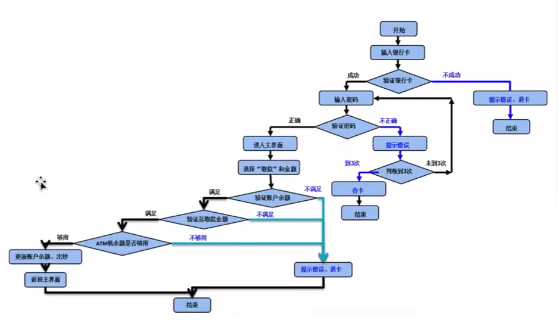

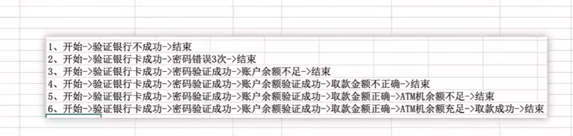

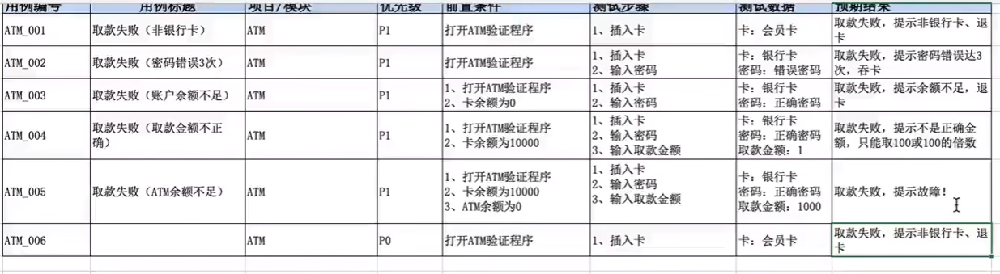

* 其实就是把退出的场景都测一遍。然后流程通过的场景测一遍。

## 10. 错误推荐法

> 当项目测试用例都执行完毕，且bug修复完成，项目尚未上线的情况下，在这段时间里可以 通过经验推测系统可能出现的问题，列出问题的清单，分析问题可能的原因。

* 时间紧、任务量大 -> 根据已有经验找出易出错的模块重点测试。

## 11. 缺陷

> 软件在使用过程中存在的**任何问题**都叫软件的缺陷，简称bug。

### 11.1 缺陷的判定标准

* **少功能**：软件未实现需求说明书中明确要求的功能
* **功能错误**：软件中出现了需求说明书中指明不应该出现的错误
* **多功能**： 软件实现的功能超出了需求说明书中指明的范围
* **隐性功能错误**： 软件未实现需求说明书中虽未明确指明，但应该实现的要求
* **不易使用**：软件难以理解，不易使用，运行缓慢，用户体验不好。

### 11.2 缺陷产生的原因

从需求到发布是一个线性的过程。其中一个环节出错，都会导致缺陷

* 阶段1. 需求阶段

  需求描述不易理解，有歧义，错误

* 阶段2. **设计阶段**

  设计文档存在错误和缺陷

* 阶段3. **编码阶段**

  代码出现错误

* 阶段4. **运行阶段**

  软硬件系统本身故障导致软件缺陷

### 11.3 缺陷的生命周期

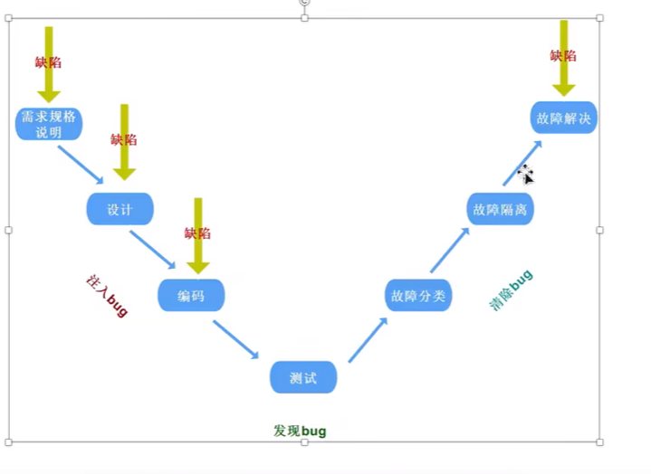

### 11.4 缺陷的核心内容

* 缺陷标题
* 缺陷预期结果
* 缺陷产生的条件
* 因缺陷得到的结果
* 复现缺陷的过程
* 缺陷的证据

### 11.5 缺陷的提交要素

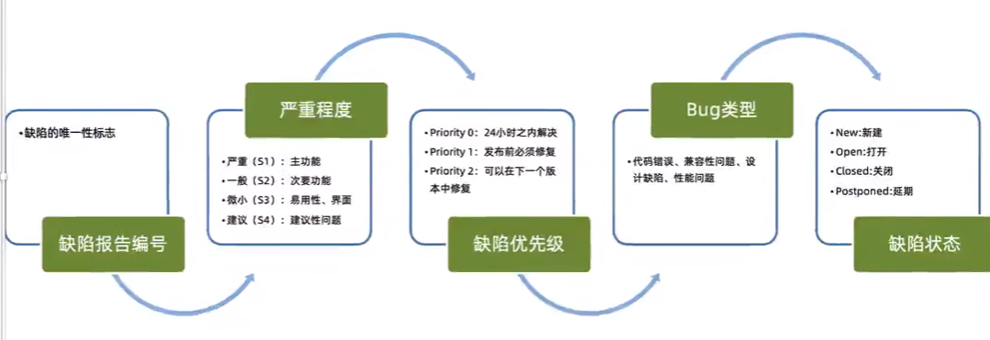

## 11.6 软件缺陷类型

* 功能错误
* UI错误
* 兼容性
* 数据
* 易用性
* 改进
* 架构

### 11.7 缺陷的跟踪流程

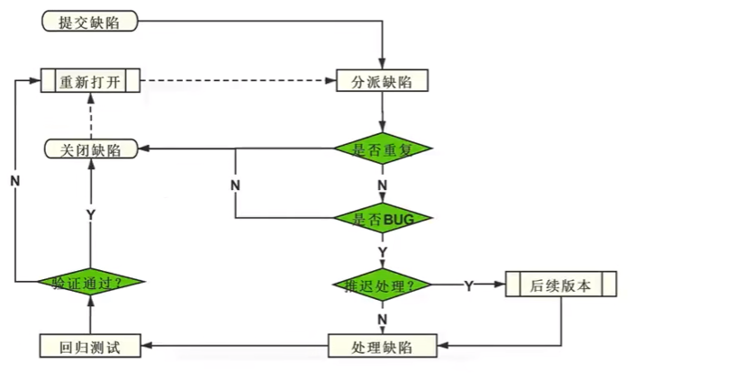

### 11.8 缺陷模板

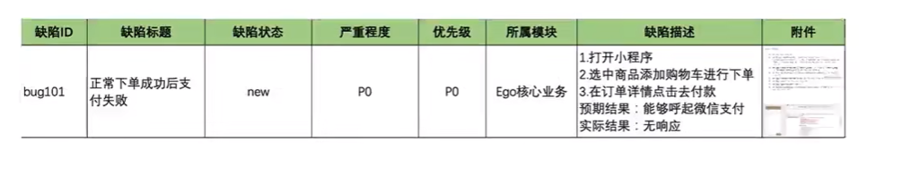